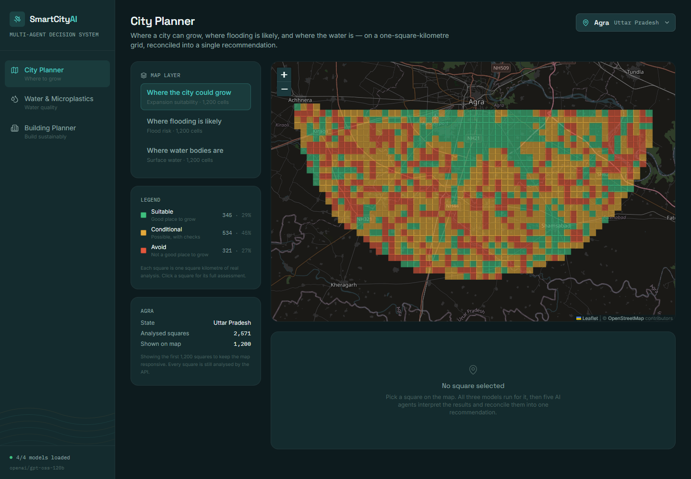
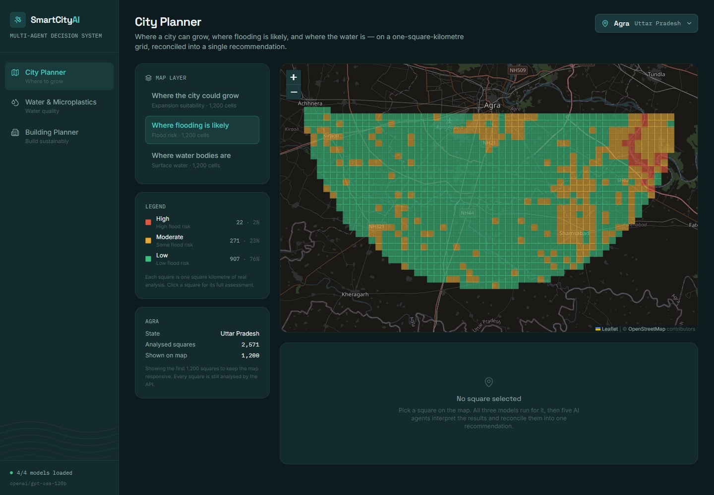
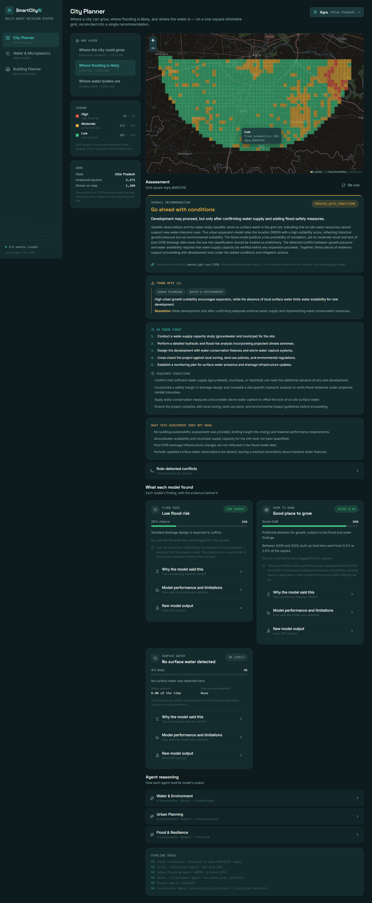
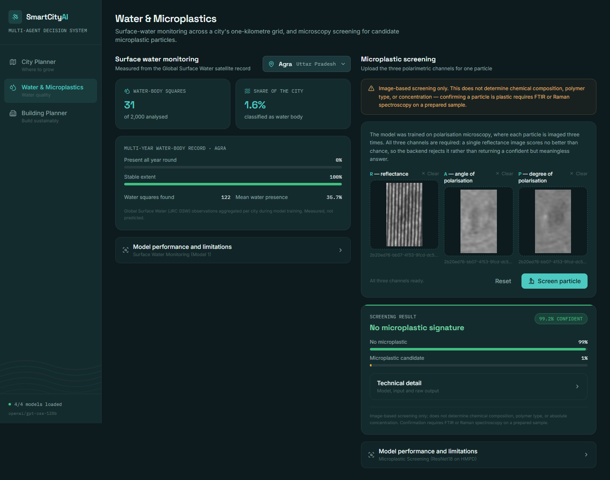
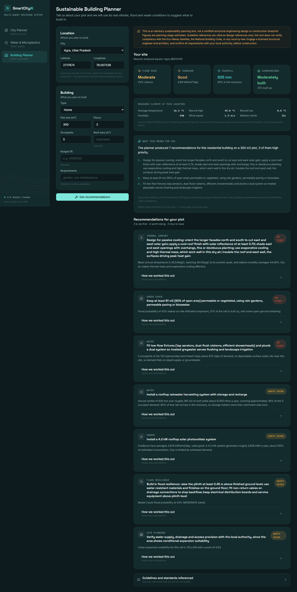

# SmartCityAI

**Multi-Agent AI Framework for Sustainable Urban Growth and Water Resource Planning**

Monitor surface water -> identify where a city can and cannot expand -> assess flood risk
-> screen for microplastics -> help citizens design sustainable buildings -> combine all of
it through an explainable AI decision-support system.

Four trained models, a deterministic rules engine, and five LangGraph agents over a shared
1 km grid covering **45 Indian cities** and **108,642 analysed cells**.



> **Governing principle:** LLM agents **interpret** predictive model outputs; they do not
> replace the predictive models. Every probability, score and classification comes from a
> trained model or a deterministic rule. The language model explains those numbers,
> reconciles them across domains, and states what they do not establish. It never computes
> one.

---

## Contents

- [What this does](#what-this-does)
- [Architecture](#architecture)
- [Status](#status)
- [Quick start](#quick-start)
- [Installation](#installation)
- [Configuration](#configuration)
- [Project structure](#project-structure)
- [API](#api)
- [Testing](#testing)
- [Verification](#verification)
- [Pipelines](#pipelines)
- [Troubleshooting](#troubleshooting)
- [Documentation](#documentation)
- [Ethics and responsible use](#ethics-and-responsible-use)
- [Data sources](#data-sources)
- [Remaining work](#remaining-work)

---

## What this does

The system answers one question — **should this place be developed, and on what terms?** —
by combining four kinds of evidence and refusing to let any one of them dominate.

### 1. City Planner

Pick a city, pick a 1 km square. All three models run for it, five agents interpret the
results, and a Coordinator reconciles them into one recommendation with its trade-offs
stated explicitly.

| Layer | Question | Classes |
|---|---|---|
| Expansion suitability | Where could the city grow? | GREEN / YELLOW / RED |
| Flood risk | Where is flooding likely? | LOW / MODERATE / HIGH |
| Surface water | Where are the water bodies? | water body / none |



The interesting case is when the layers disagree. A square with **GREEN** expansion
suitability and **HIGH** flood risk is exactly how flood-exposed development happens, and
the Coordinator says so rather than averaging it away:



### 2. Water & Microplastics

Per-city surface-water monitoring from the Global Surface Water satellite record, plus
microscopy screening for candidate microplastic particles.



### 3. Sustainable Building Planner

A citizen describes their plot; the system looks up its real flood risk, water conditions,
rainfall and sunshine, and works out what is worth building in — each recommendation
carrying the data that triggered it, the arithmetic behind it, and the guideline it cites.



---

## Architecture

```
                              REACT FRONTEND
                                    |
                                    v
                                 FASTAPI
                                    |
        +---------------------------+---------------------------+
        v                           v                           v
     MODEL 1                     MODEL 2                     MODEL 3
  Surface Water              Urban Expansion                Flood Risk
   (XGBoost)                   (LightGBM)                (Random Forest)
        |                           |                           |
        +---------------------------+---------------------------+
                                    |
                                    v
                   SUSTAINABLE BUILDING PLANNER
                  (deterministic rules + NASA POWER)
                                    |
                                    v
                                LANGGRAPH
                                    |
        +---------------------------+---------------------------+
        v                           v                           v
   Water Agent               Urban Agent                 Flood Agent
        |                           |                           |
        +---------------------------+---------------------------+
                                    v
                            Building Agent
                                    |
                                    v
                              COORDINATOR
                                    |
                                    v
                               GROQ LLM
                                    |
                                    v
                    FINAL EXPLANATION + TRADE-OFFS
                          + RECOMMENDATIONS
```

Responsibilities are strictly separated, and the separation is enforced in code rather
than by convention:

| Layer | Role | Never does |
|---|---|---|
| ML models | prediction | explain itself in prose |
| Rules engine | deterministic calculation | guess a missing input |
| LangGraph | orchestration, state, parallelism | decide anything |
| Groq LLM | interpretation, reasoning, narrative | compute a prediction |
| Coordinator | synthesis, trade-offs | alter an underlying prediction |
| FastAPI | transport, validation, errors | hide a failure |

How that is enforced:

| Enforcement | Where |
|---|---|
| Agent output schemas have no numeric prediction field | `backend/app/agents/schemas.py` |
| Model output and agent interpretation occupy separate state keys | `backend/app/agents/state.py` |
| Evidence is assembled from model output in code, never by the LLM | `backend/app/agents/base.py` |
| Conflict detection and the headline verdict are deterministic | `backend/app/agents/coordinator_agent.py` |
| The LLM may tighten a verdict, never loosen it | `backend/app/agents/coordinator_agent.py` |
| Guardrails are prepended to every prompt | `backend/app/agents/llm.py` |

Full detail in [docs/architecture.md](docs/architecture.md).

### The agent graph

```
                        START
                          |
                          v
                   validate_input          resolve onto the 1 km grid
                          |
          +---------------+---------------+
          v               v               v
     water_agent     urban_agent     flood_agent    <- one concurrent superstep
          |               |               |
          +---------------+---------------+
                          v
                   building_gate           barrier: waits for all three
                          |
              +-----------+-----------+
              v                       v
       building_agent            coordinator        conditional on building_params
              |                       |
              +-----------+-----------+
                          v
                         END
```

The three domain agents genuinely run in parallel, and a test proves it: measured 5.92 s
wall time against 14.18 s of summed agent work, across three threads.

### Tech stack

| Layer | Technology |
|---|---|
| Frontend | React 19, Vite, Tailwind CSS, React Router, Leaflet, Recharts, lucide-react |
| Backend | FastAPI, Pydantic v2, Uvicorn |
| ML | scikit-learn, XGBoost, LightGBM, PyTorch, timm, SHAP |
| Agents | LangGraph, LangChain Core, Groq (`openai/gpt-oss-120b`) |
| External data | NASA POWER (no API key required) |
| Tests | pytest, Vitest, Testing Library, Playwright |

---

## Status

| Component | State | Validation |
|---|---|---|
| **Model 1** — Surface Water (XGBoost) | trained, wired, serving | city-holdout; F1 0.627, ROC-AUC 0.861 on 7 unseen cities |
| **Model 2** — Urban Expansion (LightGBM) | trained, wired, serving | forward validation 2000-2020; accuracy 0.835 |
| **Model 3** — Flood Risk (Random Forest) | trained, wired, serving | city-holdout; F1 0.559, ROC-AUC 0.852 on 7 unseen cities |
| **Microplastic Screening** (ResNet18) | trained, wired, serving | 5-fold CV; accuracy 0.928, ROC-AUC 0.978 |
| **Sustainable Building Planner** | deterministic rules + NASA POWER | unit-tested arithmetic, cited guidelines |
| **Agent layer** | LangGraph, 5 agents, Groq | 32 tests incl. concurrency and safety-guard proofs |
| **FastAPI backend** | 33 endpoints | 66 API tests |
| **React frontend** | 3 sections, interactive map | 65 unit tests + 23 browser checks |

**Tests: 207 backend + 65 frontend passing** offline, plus 8 live backend integration
tests against real Groq and NASA POWER, and 23 browser checks driving the real UI.
Models 1 and 3 reproduce their training run's published holdout metrics to four decimal
places — see [Verification](#verification).

---

## Quick start

With the `models/` artifacts already in place and a Groq API key to hand:

```bash
# 1. Environment
cp .env.example .env          # then set GROQ_API_KEY

# 2. Backend  (terminal 1)
cd backend
python -m venv venv
source venv/bin/activate      # Windows: venv\Scripts\activate
pip install -r requirements.txt
uvicorn app.main:app --reload --port 8000

# 3. Frontend (terminal 2)
cd frontend
npm install
npm run dev
```

Open **http://localhost:5173**. Check readiness at
**http://localhost:8000/api/models/status** — it should report 4/4 models and 8/8 datasets.

Without a Groq key the system still runs end to end; agents emit deterministic summaries
labelled `source: "deterministic_fallback"`.

---

## Installation

### 1. Clone

```bash
git clone <repository-url>
cd AI-Driven-Smart-City-Planning
```

### 2. Model artifacts

The trained artifacts and their feature tables are multi-gigabyte and are distributed
alongside the repository rather than committed. Unpack them so `models/` looks like this:

```
models/
├── model1/smart-model1-surface-water/
│   ├── model1/final_grid_dataset_water.csv          Model 1 feature table
│   └── outputs/
│       ├── models/BEST_MODEL_xgboost.joblib         Model 1 artifact
│       └── metrics/                                 thresholds, city split, metrics
├── model2/model2_urban_expansion/
│   ├── best_model_model2.pkl                        Model 2 artifact
│   └── feature_list.json                            feature order and label map
├── model3/smart-model3-flood-risk/
│   ├── model3/
│   │   ├── final_grid_dataset.csv                   Model 3 feature table
│   │   ├── SmartCityAI_city_boundaries/             the 1 km grid registry
│   │   ├── SmartCityAI_GHSL_FIXED/                  GHSL built-up epochs
│   │   ├── smart_city_ai-OpenBuildings/             Open Buildings, per city
│   │   ├── smart_city_ai-SRTM_DEM/                  terrain
│   │   ├── smart_city_ai-CHIRPS/                    rainfall, per year
│   │   └── SmartCityAI_SurfaceWater_FIXED/          Global Surface Water
│   └── outputs/
│       ├── models/BEST_MODEL_random_forest.joblib   Model 3 artifact
│       └── metrics/                                 thresholds, city split, metrics
└── microplastic/Smart-city-microplastic/
    ├── models/model4_microplastic_screening/
    │   ├── final_model_resnet18.pt                  Microplastic artifact
    │   ├── config.json                              architecture and CV metrics
    │   └── cv_results.csv                           per-fold results
    └── HMPD-Gen/HMPD-Gen/                           HMPD images and labels
```

Every path has a repository-relative default, so this layout needs no configuration.
Anything stored elsewhere can be redirected through `.env` — see
[Configuration](#configuration).

Verify with `GET /api/models/status` once the backend is running.

### 3. Environment

```bash
cp .env.example .env
```

Then add a Groq API key (free at [console.groq.com](https://console.groq.com)):

```env
GROQ_API_KEY=your-key-here
GROQ_MODEL=openai/gpt-oss-120b
```

`.env` is git-ignored and must never be committed. **No key is hard-coded anywhere in the
source.** Without a key the system still runs end to end: agents emit deterministic
summaries labelled `source: "deterministic_fallback"`.

### 4. Backend

```bash
cd backend
python -m venv venv
source venv/bin/activate          # Windows: venv\Scripts\activate
pip install -r requirements.txt
uvicorn app.main:app --reload --port 8000
```

Interactive API docs: **http://localhost:8000/docs**

### 5. Frontend

```bash
cd frontend
npm install
npm run dev
```

Served at **http://localhost:5173**. It expects the backend at
`http://localhost:8000`; override with `VITE_API_BASE_URL` in `frontend/.env.local`.

---

## Configuration

Defaults resolve relative to the repository, so a standard layout needs only
`GROQ_API_KEY`. Everything below is overridable in `.env`.

### LLM

| Variable | Default | Purpose |
|---|---|---|
| `GROQ_API_KEY` | — | Required for agent narratives |
| `GROQ_MODEL` | `openai/gpt-oss-120b` | Primary model |
| `GROQ_FALLBACK_MODEL` | — | Optional second model, tried on failure |
| `LLM_TEMPERATURE` | `0.3` | |
| `LLM_TIMEOUT` | `60` | Seconds |
| `LLM_ENABLED` | `true` | `false` runs fully without the LLM |

Ollama is **not** a dependency. If the configured Groq model becomes unavailable, change
`GROQ_MODEL` — no code change is needed.

### Model artifacts and data

| Variable | Purpose |
|---|---|
| `MODELS_ROOT`, `DATA_ROOT` | Roots for artifacts and data |
| `SURFACE_WATER_MODEL_PATH` | Model 1 artifact |
| `URBAN_MODEL_PATH`, `MODEL2_FEATURES_JSON` | Model 2 artifact and feature list |
| `FLOOD_MODEL_PATH` | Model 3 artifact |
| `MICROPLASTIC_MODEL_PATH`, `MODEL4_CONFIG_JSON` | Microplastic artifact and config |
| `MODEL1_DATASET`, `MODEL3_DATASET` | Pre-merged feature tables |
| `GRID_METADATA_CSV` | The 1 km grid registry |
| `GHSL_DIR`, `OPEN_BUILDINGS_DIR`, `SRTM_CSV`, `CHIRPS_DIR`, `SURFACE_WATER_LAYER_CSV` | Source layers for Model 2 assembly |
| `MODEL1_ALGORITHM`, `MODEL3_ALGORITHM` | Which artifact and tuned threshold to serve |

### Thresholds

| Variable | Default | Purpose |
|---|---|---|
| `FLOOD_RISK_MODERATE_THRESHOLD` | `0.30` | MODERATE band edge |
| `FLOOD_RISK_HIGH_THRESHOLD` | `0.60` | HIGH band edge |
| `URBAN_CLASS_FROM_SCORE` | `false` | `true` labels by score instead of argmax |
| `URBAN_SCORE_GREEN_THRESHOLD` | `0.66` | |
| `URBAN_SCORE_YELLOW_THRESHOLD` | `0.33` | |
| `WATER_OCCURRENCE_THRESHOLD_PCT` | `25` | Model 1 target definition |

Thresholds are documented in the model cards and exposed at
`/api/flood-risk/thresholds` and `/api/urban-expansion/thresholds`.

---

## Project structure

```
AI-Driven-Smart-City-Planning/
├── backend/
│   ├── app/
│   │   ├── main.py                  FastAPI app, CORS, error handlers, startup warm-up
│   │   ├── core/
│   │   │   ├── config.py            every path and key, env-driven; no hard-coded paths
│   │   │   ├── errors.py            domain exceptions -> HTTP envelope
│   │   │   ├── grid.py              the shared 1 km EPSG:4326 analysis grid
│   │   │   ├── logging_config.py    request-id correlation
│   │   │   └── building_guidelines.py   cited guideline parameters with provenance
│   │   ├── routers/                 system, water, urban, flood, microplastics,
│   │   │                            building, agents
│   │   ├── schemas/                 requests.py, responses.py
│   │   ├── services/
│   │   │   ├── models/
│   │   │   │   ├── registry.py      singleton model loading
│   │   │   │   ├── feature_store.py feature-table assembly
│   │   │   │   ├── explain.py       SHAP attributions
│   │   │   │   ├── surface_water.py     Model 1
│   │   │   │   ├── urban_expansion.py   Model 2
│   │   │   │   ├── flood_risk.py        Model 3
│   │   │   │   └── microplastic.py      Microplastic screening
│   │   │   └── building_planner/
│   │   │       ├── nasa_power.py            NASA POWER service layer
│   │   │       ├── site_analyzer.py         evidence assembly for a site
│   │   │       └── recommendation_engine.py deterministic rules
│   │   └── agents/
│   │       ├── graph.py             the LangGraph StateGraph
│   │       ├── state.py             CityState
│   │       ├── schemas.py           structured output contracts
│   │       ├── llm.py               Groq client + guardrails
│   │       ├── base.py              shared agent machinery
│   │       └── water_agent.py, urban_agent.py, flood_agent.py,
│   │           building_agent.py, coordinator_agent.py
│   ├── scripts/
│   │   ├── download/                source-layer provenance
│   │   ├── preprocess/              grid-alignment validation
│   │   ├── features/                feature-table assembly
│   │   └── evaluation/              validation of the shipped artifacts
│   ├── tests/                       207 offline + 8 opt-in live tests
│   └── requirements.txt
├── frontend/
│   ├── src/
│   │   ├── api/client.js            the only module that talks to the backend
│   │   ├── hooks/useAsync.js        request state; aborts on change and unmount
│   │   ├── lib/domain.js            class -> colour/label/wording, one source of truth
│   │   ├── components/              ui, map, cell, ai, technical, microplastic, layout
│   │   └── pages/                   CityPlanner, WaterMicroplastics, BuildingPlanner
│   ├── e2e/smoke.mjs                23 browser checks against a live backend
│   └── package.json
├── models/                          trained artifacts (~6.5 GB, not committed)
├── docs/
│   ├── architecture.md
│   ├── model_cards/                 one per model, with real metrics and limitations
│   └── images/                      screenshots used by this README
├── .env.example
└── README.md
```

---

## API

33 endpoints. Full interactive reference at `/docs`.

### System

| Method | Path | Purpose |
|---|---|---|
| GET | `/health` | Liveness, model and dataset readiness |
| GET | `/api/models/status` | Per-model load state, datasets, LLM, SHAP, caches |
| GET | `/api/grid/cities` | The 45 cities with cell counts |
| GET | `/api/grid/cities/{city}/cells` | Grid cell ids for a city |
| GET | `/api/grid/cities/{city}/geojson` | Bare grid geometry |
| GET | `/api/grid/cell/{grid_id}` | One cell with its polygon |
| GET | `/api/grid/nearest?lat=&lon=` | Nearest cell and snap distance |

### Model 1 — Surface Water

| Method | Path |
|---|---|
| POST | `/api/water` |
| GET | `/api/water/cell/{grid_id}` |
| GET | `/api/water/city/{city}` |
| GET | `/api/water/city/{city}/geojson` |
| GET | `/api/water/monitoring/{city}` |
| GET | `/api/water/metrics` |

### Model 2 — Urban Expansion

| Method | Path |
|---|---|
| POST | `/api/urban-expansion` |
| GET | `/api/urban-expansion/cell/{grid_id}` |
| GET | `/api/urban-expansion/city/{city}` |
| GET | `/api/urban-expansion/city/{city}/geojson` |
| GET | `/api/urban-expansion/thresholds` |
| GET | `/api/urban-expansion/metrics` |

### Model 3 — Flood Risk

| Method | Path |
|---|---|
| POST | `/api/flood-risk` |
| GET | `/api/flood-risk/cell/{grid_id}` |
| GET | `/api/flood-risk/city/{city}` |
| GET | `/api/flood-risk/city/{city}/geojson` |
| GET | `/api/flood-risk/thresholds` |
| GET | `/api/flood-risk/metrics` |

### Microplastics

| Method | Path | Notes |
|---|---|---|
| POST | `/api/microplastics/analyze` | Three polarimetric channels (R, A, P) |
| POST | `/api/microplastics/analyze-composite` | One pre-stacked 3-channel image |
| GET | `/api/microplastics/metrics` | |

### Building Planner

| Method | Path |
|---|---|
| POST | `/api/building-planner` |
| GET | `/api/building-planner/site?lat=&lon=` |
| GET | `/api/building-planner/guidelines` |
| POST | `/api/building-planner/nasa-power` |

### Agents

| Method | Path | Purpose |
|---|---|---|
| POST | `/api/agents/analyze` | Full LangGraph pipeline |
| POST | `/api/coordinator` | Same run, coordinator-first payload |
| POST | `/api/agents/{water\|urban\|flood}` | One agent in isolation |
| GET | `/api/agents` | Agents, models wrapped, role boundaries |
| GET | `/api/agents/graph` | Graph topology |

### Example

```bash
curl -X POST http://localhost:8000/api/coordinator \
  -H 'Content-Type: application/json' \
  -d '{"grid_id": "Chennai_89281444"}'
```

A cell where growth suitability and flood risk conflict:

```json
{
  "recommendation": {
    "overall_recommendation": "proceed_with_strong_mitigation",
    "headline": "Proceed with development only if strong flood mitigation and
                 alternative water supplies are put in place.",
    "trade_offs": [{
      "between": ["urban", "flood"],
      "tension": "High growth suitability (GREEN) coincides with a HIGH flood risk...",
      "resolution": "Allow development only if comprehensive flood mitigation..."
    }]
  },
  "domain_signals": {
    "urban": {"suitability_class": "GREEN", "suitability_score": 0.975},
    "flood": {"risk_level": "HIGH", "flood_probability": 0.6746}
  },
  "interpretation_source": "llm",
  "llm_model": "openai/gpt-oss-120b"
}
```

### Errors

One envelope for every failure:

```json
{
  "error": "upstream_unavailable",
  "message": "NASA POWER did not respond in time. Unable to retrieve meteorological data.",
  "detail": {"service": "NASA POWER", "timeout_seconds": 30}
}
```

| Code | HTTP | Meaning |
|---|---|---|
| `invalid_input` | 400/422 | Input outside the accepted domain |
| `grid_not_found` | 404 | Cell or city not in the analysis grid |
| `model_unavailable` | 503 | Artifact missing; names the file and config key |
| `dataset_unavailable` | 503 | Feature dataset missing |
| `upstream_unavailable` | 502 | NASA POWER or Groq unreachable |
| `inference_failed` | 500 | Model loaded but prediction failed |

**Nothing is ever silently substituted.** A missing model, dataset or upstream service
produces an error naming exactly what is absent — never a plausible-looking number.

---

## Testing

```bash
cd backend
pytest                                   # 207 tests, offline, no Groq key needed
pytest -v                                # verbose
pytest tests/test_end_to_end.py          # the full workflow
```

| File | Tests | Covers |
|---|---|---|
| `tests/test_grid.py` | 14 | Grid registry, nearest-cell, polygons, CRS, GeoJSON |
| `tests/test_models.py` | 45 | Inference contracts, **metric reproduction**, SHAP, uploads |
| `tests/test_agents.py` | 32 | Trade-off cases, safety guard, **concurrency proof**, guardrails |
| `tests/test_building_planner.py` | 42 | Guideline provenance, NASA POWER failure modes, rule arithmetic |
| `tests/test_api.py` | 66 | Every endpoint, plus failure paths |
| `tests/test_end_to_end.py` | 4 | The complete documented workflow |

The suite is offline and deterministic: the LLM is disabled by an autouse fixture, and
NASA POWER is mocked. No test invents data — grid cells, cities and images are discovered
from the real artifacts, and tests skip with a clear reason if an artifact is absent.

### Frontend

```bash
cd frontend
npm test                 # 65 unit and component tests
npm run test:e2e         # 23 browser checks against a live backend
```

| File | Tests | Covers |
|---|---|---|
| `src/api/client.test.js` | 13 | Error envelopes, aborts, request shapes, uploads |
| `src/lib/domain.test.js` | 17 | Class metadata completeness, colour consistency, formatting |
| `src/components/ui/ui.test.jsx` | 11 | Error display, disclosures, missing-value handling |
| `src/components/cell/CellSummary.test.jsx` | 13 | The honesty rules (see below) |
| `src/components/ai/CoordinatorPanel.test.jsx` | 11 | Verdicts, trade-offs, LLM attribution |

The component tests assert the project's honesty rules directly: that a LOW flood
result is shown as *absence of evidence, not safety*; that a GREEN suitability score
is described as development pressure rather than approval; that satellite figures are
labelled as measurements; that a missing value reads "not available" rather than zero;
and that unavailable SHAP attributions are reported as unavailable rather than
approximated.

`npm run test:e2e` drives the real UI in Chrome against a running backend and checks
that the map draws real grid polygons, a cell click runs the whole agent pipeline, the
microplastic screening agrees with the HMPD ground-truth label, and the building planner
produces recommendations from live NASA POWER data.

### Live integration tests

Opt-in, against the real services:

```bash
SMARTCITY_LIVE_TESTS=1 pytest tests/test_integration_live.py -v
```

8 tests covering NASA POWER (plausible values, daily coverage, monsoon signal, no key
required) and Groq (structured agent output, structured coordinator output, and that the
guardrails stop the model inventing an absent value).

---

## Verification

The claims in this README are checked, not asserted.

### Models 1 and 3 reproduce their published holdout metrics exactly

```bash
cd backend
python -m scripts.evaluation.evaluate_models --model all
```

Recomputes precision, recall, F1, ROC-AUC and PR-AUC on the training run's own unseen-city
test split, and compares against its saved `test_metrics_comparison.csv`:

```
Model 1 — Surface Water Monitoring
  Reproduction against the training run's saved metrics: MATCH
    precision  published=0.8017 recomputed=0.8017 [ok]
    recall     published=0.5152 recomputed=0.5152 [ok]
    f1         published=0.6273 recomputed=0.6273 [ok]
    roc_auc    published=0.8614 recomputed=0.8614 [ok]
    pr_auc     published=0.7274 recomputed=0.7274 [ok]

Model 3 — Urban Flood Risk
  Reproduction against the training run's saved metrics: MATCH
    precision  published=0.7046 recomputed=0.7046 [ok]
    ...
```

This is what proves the inference path in this repository *is* the trained one. Any drift
in feature assembly, feature ordering or threshold handling would move these numbers. The
same check runs as a pytest case.

### Model 2's forward validation and encoding reconstruction

```bash
python -m scripts.evaluation.evaluate_urban_expansion --out build/
```

The training run did not document the `city_code`/`state_code` encoding, so this
repository reconstructed it. Verified empirically: predictions agree with the tercile-binned
GHSL growth target on **85.4%** of cells, against a 33% chance level and the 83.5% accuracy
the training run reported. Also reports per-city accuracy (range 0.798–0.924).

### The metrics this project refuses to claim

An earlier project document described Model 1 as a LightGBM **regressor** with R² = 0.995
(random split) and R² = 0.985 (unseen-city holdout). The artifact this repository ships is
a **classifier**, and those figures cannot be reproduced from it — they belong to a
different lineage. **They are therefore never reported.** A test
(`test_metrics_do_not_claim_the_unreproducible_regression_scores`) enforces this.

### Microplastic input construction

Verified against HMPD ground truth on 231 labelled particles:

| Input | Accuracy | Recall |
|---|---|---|
| R/A/P stacked (correct) | **0.978** | 0.977 |
| R only, replicated to RGB | 0.450 | 0.008 |

Hence the API requires all three channels and **rejects** a single-channel upload rather
than returning a confident, meaningless answer.

### The UI renders real data, not a mock

`npm run test:e2e` verified, in Chrome against the live backend:

```
PASS  map renders real grid cells  — 1200 polygons
PASS  coordinator verdict rendered  — Go ahead with conditions
PASS  SHAP attribution panel opens
PASS  per-city performance table renders
PASS  microplastic screening matches HMPD label  — label=0 -> "No microplastic signature"
PASS  recommendations rendered  — 7 recommendations
23/23 checks passed · No application console errors.
```

### Agent parallelism

`tests/test_agents.py::TestGraph::test_domain_agents_run_concurrently` asserts the three
domain agents' execution windows overlap, that they run on more than one thread, and that
wall time is below the serial sum. Measured: 5.92 s wall against 14.18 s of summed agent
work.

---

## Pipelines

```
backend/scripts/
├── download/      source layer provenance and how to extend to new cities
├── preprocess/    cleaning and grid alignment
├── features/      feature table assembly
└── evaluation/    validation of the shipped artifacts
```

```bash
python -m scripts.features.build_urban_expansion_features --out build/ --with-target
python -m scripts.evaluation.evaluate_models --model all
python -m scripts.evaluation.evaluate_urban_expansion --out build/
```

Each script documents its `input → preprocessing → feature engineering → output` contract,
resolves all paths through `app.core.config`, and writes a JSON manifest recording sources,
row counts and feature completeness. Nothing depends on a hand-edited notebook.

No dataset needs downloading to run or evaluate this project: the processed feature tables
ship with the artifacts. `scripts/download/README.md` records provenance for anyone
extending the work.

---

## Troubleshooting

### `/health` reports `degraded`, or fewer than 4/4 models

Check `GET /api/models/status`. It names each artifact, whether the file is present, and
which config key points at it.

```json
{
  "models": {
    "model3_flood_risk": {
      "loaded": false,
      "artifact_present": false,
      "artifact": "BEST_MODEL_random_forest.joblib"
    }
  }
}
```

Either place the `models/` bundle in the layout shown under [Installation](#installation),
or point the matching `*_MODEL_PATH` / `*_DATASET` variable in `.env` at wherever it lives.
Endpoints needing a missing model return `503 model_unavailable` naming the file and the
config key — they never fall back to a made-up number.

### The frontend loads but every panel shows an error

The backend is unreachable. Confirm it is running on port 8000, and that
`VITE_API_BASE_URL` matches if you changed the port. The sidebar shows live backend status.

### Agent narratives say `deterministic_fallback`

The LLM was unavailable, and the reason is in the `note` field. Common causes:

| Cause | Fix |
|---|---|
| `GROQ_API_KEY` not set | Add it to `.env` |
| Rate limit (HTTP 429) | Groq's free tier caps tokens per minute; wait, or use a paid tier |
| `LLM_ENABLED=false` | Set it to `true` |

The pipeline completes and returns a full analysis either way — only the prose changes.

### `502 upstream_unavailable` from the Building Planner

NASA POWER is unreachable or rate-limiting. The planner deliberately does **not**
substitute fallback climate values: it skips the rules that needed that data and says
which. Retry in a few minutes.

### Microplastic upload rejected with "single-channel image"

The model needs all three polarimetric channels (R, A, P). A single reflectance image
scores at chance level, so it is rejected rather than scored. Use
`POST /api/microplastics/analyze` with all three, or composite them in R/A/P order.

### `404 grid_not_found` for a location

The coordinates are more than 25 km from any analysed cell — the trained models cover 45
Indian cities only. `GET /api/grid/cities` lists them.

### `npm run test:e2e` cannot find Chrome

Set `CHROME_PATH` to your Chrome executable. Both servers must also be running.

### Map tiles fail to load

Tiles come from the public OpenStreetMap service, which needs no key but is rate-limited
and intended for low volume. For real traffic, host your own tiles or use a keyed provider
(the `TileLayer` URL is in `frontend/src/components/map/GridMap.jsx`).

---

## Data sources

All layers are exported onto the shared 1 km grid. See
[backend/scripts/download/README.md](backend/scripts/download/README.md) for provenance and
for how to extend the grid to new cities.

| Dataset | Provider | Used for |
|---|---|---|
| Global Surface Water (JRC GSW 1.4) | European Commission JRC | Model 1 target, water features for Model 3 |
| Global Flood Database (MODIS events) | Cloud to Street / Dartmouth | Model 3 flood labels |
| GHSL built-up surface | European Commission JRC | Model 2 forward-validation target, Model 3 features |
| Google Open Buildings (temporal) | Google Research | Building count, height, presence |
| SRTM digital elevation model | NASA / USGS | Elevation, slope, depression index |
| CHIRPS rainfall | UCSB Climate Hazards Center | Rainfall climatology |
| Dynamic World land cover | Google / WRI | Built and tree fractions |
| Sentinel-2 surface reflectance | ESA Copernicus | NDVI, NDBI spectral indices |
| HMPD | Hyperspectral MicroPlastic Dataset | Microplastic screening training data |
| NASA POWER | NASA Langley Research Center | Live solar and meteorological data |
| OpenStreetMap | OSM contributors | Basemap tiles |

Guideline references: Bureau of Energy Efficiency (Eco-Niwas Samhita), CPHEEO, Bureau of
Indian Standards (NBC 2016), Ministry of New and Renewable Energy.

**OpenStreetMap road data was deliberately excluded** from Model 2: coverage existed for
only 3 of the 45 cities, so the feature would have encoded data availability rather than
accessibility.

---

## Documentation

| Document | Contents |
|---|---|
| [docs/architecture.md](docs/architecture.md) | Layers, request flow, the LangGraph graph, state, trade-off logic, degradation |
| [docs/model_cards/model1_surface_water.md](docs/model_cards/model1_surface_water.md) | Model 1: purpose, features, metrics, per-city performance, limitations |
| [docs/model_cards/model2_urban_expansion.md](docs/model_cards/model2_urban_expansion.md) | Model 2: forward validation, score definition, thresholds, limitations |
| [docs/model_cards/model3_flood_risk.md](docs/model_cards/model3_flood_risk.md) | Model 3: city-holdout, risk bands, per-city performance, limitations |
| [docs/model_cards/model4_microplastic.md](docs/model_cards/model4_microplastic.md) | Microplastic: scope disclaimer, input construction, CV metrics |
| [docs/model_cards/building_planner.md](docs/model_cards/building_planner.md) | Rules, guideline provenance, BEE citation and compliance status |
| [frontend/README.md](frontend/README.md) | Frontend structure, scripts and design decisions |
| [backend/scripts/README.md](backend/scripts/README.md) | Pipeline scripts |
| [backend/scripts/download/README.md](backend/scripts/download/README.md) | Source layers and extending to new cities |

---

## Ethics and responsible use

- **Transparency.** Every response separates model predictions, measurements, rule-based
  calculations and LLM interpretation, and labels which is which.
- **Explainability.** Per-prediction SHAP attributions, deterministic driver and constraint
  lists citing the measurements behind them, and documented thresholds.
- **Honest degradation.** A missing model, dataset or upstream service produces a stated
  error. When the LLM is unavailable, the response says
  `source: "deterministic_fallback"` and gives the reason.
- **Environmental resilience is not overridable.** A cell classified as a surface-water
  body is an ecological hard stop: the Coordinator discourages development there regardless
  of how favourable its growth score is. Flood and water evidence remain visible in the
  final recommendation even when development pressure is high, because they are part of the
  deterministic baseline rather than left to the LLM's discretion.
- **Uncertainty is stated, not buried.** Both Models 1 and 3 have moderate recall, so a
  negative result is reported as *absence of evidence, not evidence of safety* — in the API
  payload, in the agent narratives, and in the model cards.
- **Scientific limits respected.** The microplastic module never claims chemical
  composition or concentration. The building planner never claims code compliance or issues
  structural engineering instructions.
- **Per-city variance published.** Both geospatial models perform far better in some cities
  than others (Model 1 F1 ranges 0.00–0.90). The per-city tables are in the model cards and
  served by the `/metrics` endpoints, so a user can see whether the model works where they
  are.

### Security

- `.env` is git-ignored; no key appears in source. `llm_status()` reports only
  `api_key_configured: bool`.
- Uploads are validated for size and extension and must decode as an image; client
  filenames are reduced to their basename and used only for the extension check.
- CORS is restricted to configured origins, with an explicit method and header allow-list.
- Error envelopes carry file *names*, never filesystem paths.
- All logging is correlated by request id; secrets are never logged.

---

## Remaining work

1. **Retrain Model 2 with a declared city split.** Its training run saved no split
   manifest, so its 0.835 accuracy cannot be attributed to a spatial holdout. This is the
   weakest validation evidence among the three geospatial models and the highest-value
   improvement available.
2. **Per-city thresholds.** Models 1 and 3 apply one global threshold across cities whose
   positive rates vary by an order of magnitude, which is the main driver of their per-city
   variance (Model 1 scores F1 0.00 in Ludhiana, 0.90 in Chennai).
3. **Groq free-tier token budget.** The tier caps tokens per minute, so a full five-agent
   run can be rate-limited; the pipeline then falls back deterministically and reports it.
   A paid tier or further prompt compaction would remove this.
4. **Map basemap tiles.** The public OpenStreetMap tile service is used because it needs
   no API key. For real traffic, host tiles or move to a keyed provider.

Not implemented, and deliberately excluded per the project specification: GRACE,
groundwater depletion, separate water-demand forecasting, ERA5, and NSGA-II optimisation.
