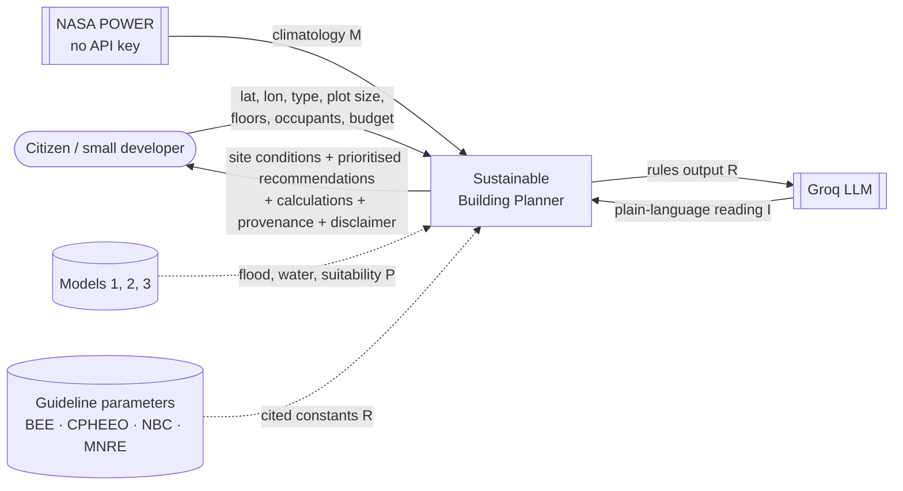
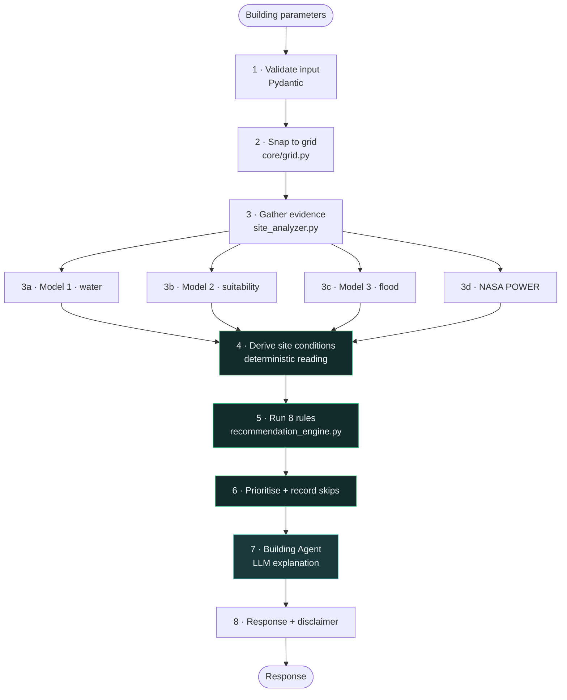
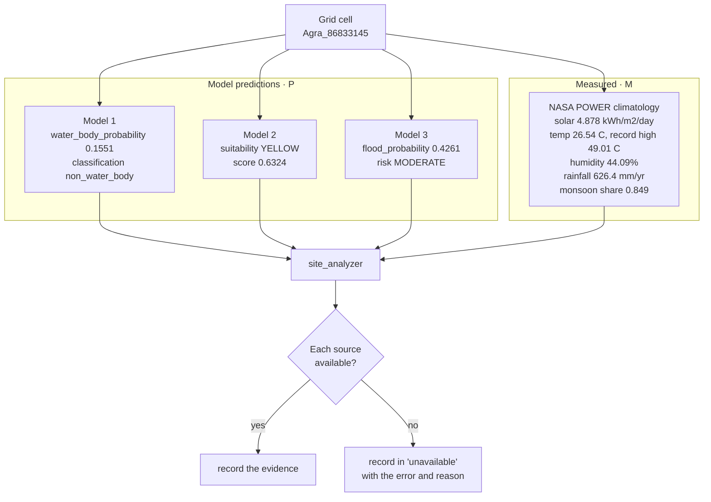
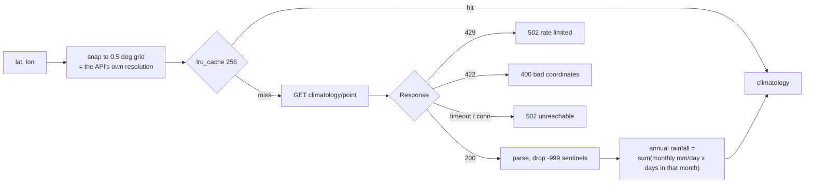
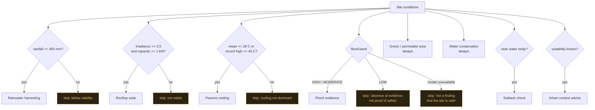
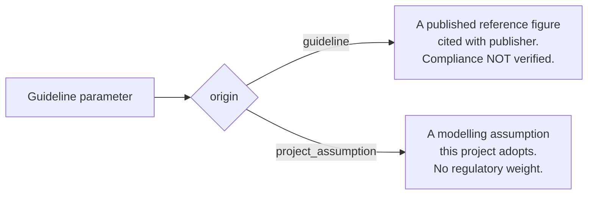
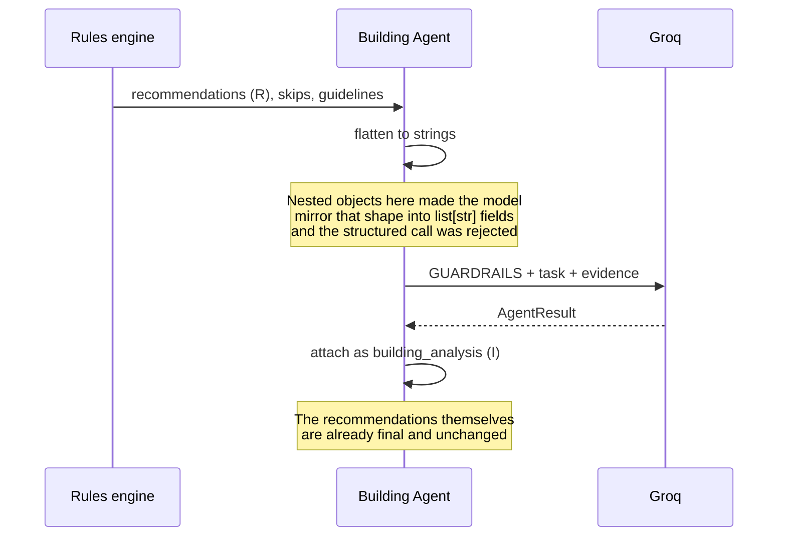
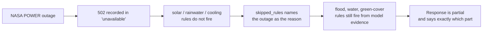

# Process 2 — Sustainable Building Planner: Data Flow

**Question answered:** given this specific plot, what is worth building in — and why?

The defining property of this process: **no ML model decides anything here.** Which
recommendations fire, and every number in them, come from deterministic rules over cited
parameters. The three geospatial models and NASA POWER supply *evidence*; the LLM
*explains* the output. Neither can change a recommendation.

Payloads below are real, captured for **27.1767°N 78.0072°E** (Agra), a 300 m² plot with
5 occupants over 2 floors.

---

## Level 0 — Context



---

## Level 1 — Stages



Green stages are deterministic; only stage 7 involves an LLM, and it comes **after** the
recommendations are already fixed.

---

## Stage 1 — Validate

`BuildingParams` (Pydantic, `extra="forbid"`):

| Field | Constraint |
|---|---|
| `lat`, `lon` | −90…90, −180…180 |
| `building_type` | `residential` \| `office` \| `commercial` |
| `plot_size_sqm` | > 0, ≤ 1,000,000 |
| `floors` | 1…100 |
| `occupants` | 1…100,000 |
| `budget_inr` | ≥ 0, optional |
| `roof_area_sqm` | > 0, optional, **must not exceed plot size** |

Cross-field validation is real: a roof larger than its plot is rejected with
`422 invalid_input`.

---

## Stage 3 — Gather evidence (parallel-capable, independent sources)



Each source is attempted independently. A failure is **recorded**, never substituted:

```json
{
"data_completeness": {
  "surface_water_model": true,
  "urban_expansion_model": true,
  "flood_risk_model": true,
  "nasa_power": true
}
}
```

### NASA POWER service

`app/services/building_planner/nasa_power.py`



Parameters: `ALLSKY_SFC_SW_DWN`, `T2M`, `T2M_MAX`, `T2M_MIN`, `PRECTOTCORR`, `RH2M`,
`WS2M`. **No API key required.**

```json
{
  "source": "NASA POWER",
  "endpoint": "temporal/climatology/point",
  "requested": { "latitude": 27.1767, "longitude": 78.0072 },
  "resolved_grid_point": { "latitude": 27.0, "longitude": 78.0 },
  "solar_kwh_m2_day": 4.878,
  "temperature_c": 26.54,
  "temperature_max_c": 49.01,
  "temperature_min_c": 0.03,
  "humidity_pct": 44.09,
  "wind_speed_m_s": 1.92,
  "rainfall_annual_mm": 626.4,
  "wettest_month": "JUL",
  "monsoon_concentration": 0.849
}
```

Two details that matter:

- **Annual rainfall is weighted by real month lengths**, not a flat ×30 or ×365 factor.
- **`T2M_MAX`/`T2M_MIN` annual values are observed extremes**, not typical daily highs
  and lows — 49.01 °C is Agra's record, not a summer average. The UI labels them "record
  high" and "record low", and the cooling trigger is set against that extreme (40 °C)
  rather than a threshold that would be true almost everywhere in India.

---

## Stage 4 — Derive site conditions

Deterministic readings of the evidence, computed in code:

```json
{
"derived": {
  "water_proximity": {
    "classification": "dry",
    "reason": "No surface water is detected in this cell.",
    "occurrence_pct": 0.0
  },
  "green_cover": {
    "classification": "moderately_built",
    "built_fraction": 0.3393,
    "non_built_fraction": 0.6607
  },
  "solar_potential": {
    "classification": "good",
    "irradiance_kwh_m2_day": 4.878
  },
  "rainfall_regime": {
    "annual_mm": 626.4,
    "wettest_month": "JUL",
    "monsoon_concentration": 0.849
  }
}
}
```

The response keeps `model_predictions`, `measured` and `derived` in separate blocks, so a
reader always knows which is which.

---

## Stage 5 — The rules

Eight rules. Each emits `recommendation`, `priority`, `reason`, `triggering_data`,
`calculations` and `guideline_basis`.



### Formulas

| Rule | Formula |
|---|---|
| Rainwater | `yield_L = roof_area_m² × (rainfall_mm / 1000) × runoff_coefficient × 1000` |
| Solar | `generation_kWh_day = capacity_kW × irradiance × performance_ratio` |
| Solar sizing | `capacity = min(roof_limited, demand_matched)` — the binding one is reported |
| Passive cooling | `openable_area_m² = floor_area_m² × 0.125` |
| Permeable area | `permeable_m² = (plot − plot × ground_coverage) × permeable_share` |
| Water saving | `saving_L_day = occupants × lpcd × (fixture_saving + greywater_share)` |

### A real recommendation, in full

```json
{
  "recommendation": "Design for passive cooling: orient the longer facades north and south to cut east and west solar gain; apply a cool-roof finish with solar reflectance of at least 0.70; shade east and west openings with overhangs, fins or deciduous planting; use evaporative cooling and high thermal mass, which work well in this dry air; insulate the roof and west wall, the surfaces driving peak heat gain",
  "category": "thermal_comfort",
  "priority": "HIGH",
  "reason": "Mean annual temperature is 26.54°C, with a record high of 49.01°C, and relative humidity averages 44.09%. Dry air makes thermal mass and evaporative cooling effective.",

  "triggering_data": {
    "temperature_c": 26.54,
    "temperature_max_c": 49.01,
    "humidity_pct": 44.09
  },

  "calculations": {
    "estimated_floor_area_sqm": 330.0,
    "required_openable_area_sqm": 41.2,
    "openable_area_share_of_floor": 0.125,
    "formula": "openable_area_m2 = floor_area_m2 * openable_area_share"
  },

  "guideline_basis": [
    {
      "parameter": "thermal.openable_area_share_of_floor",
      "value": 0.125,
      "unit": "fraction",
      "origin": "guideline",
      "note": "Eco-Niwas Samhita requires openable window area of at least 12.5% of floor area for natural ventilation in naturally ventilated dwellings.",
      "source_title": "Eco-Niwas Samhita (Energy Conservation Building Code - Residential)",
      "source_publisher": "Bureau of Energy Efficiency (BEE), Government of India"
    }
  ]
}
```

Every recommendation is traceable end to end: the measurement that triggered it, the
arithmetic, the formula, and the document each constant came from.

### Provenance is typed



| Parameter | Value | Origin | Source |
|---|---|---|---|
| Domestic water demand | 135 L/person/day | guideline | CPHEEO |
| Roof runoff coefficient | 0.85 | guideline | NBC 2016 |
| Openable area / floor area | 0.125 | guideline | **Eco-Niwas Samhita** |
| Cool-roof solar reflectance | 0.70 | guideline | **Eco-Niwas Samhita** |
| Rooftop area per kW | 10 m²/kW | guideline | MNRE |
| Plinth raise (moderate / high) | 0.45 m / 0.75 m | guideline | NBC 2016 |
| Roof share of plot | 0.55 | project_assumption | — |
| Usable roof share for PV | 0.60 | project_assumption | — |

**On Eco-Niwas Samhita specifically:** these are cited as *design references*. The tool
does **not** verify compliance — that depends on envelope U-values, window assembly
specifications and climate-zone RETV calculations requiring actual architectural
drawings, none of which this tool has. No regulatory requirement is invented.

### Solar sizing is capped by demand

Sizing to available roof area alone over-specifies systems, so capacity is the lesser of
roof-limited and demand-matched, and the binding constraint is reported:

| Case | Roof-limited | Demand-matched | Recommended | Limited by |
|---|---|---|---|---|
| 5-person home, 250 m² | 8.2 kW | 3.9 kW | **3.9 kW** | estimated demand |
| 4-floor office, 800 m² | 26.4 kW | 127.4 kW | **26.4 kW** | roof area |

---

## Stage 6 — Rules that did not fire

A skipped rule is **reported with its reason**, which is as informative as one that
fired:

```json
{
"skipped_rules": [
  {
    "rule": "Flood resilience (elevated-risk measures)",
    "reason": "Modelled flood probability is 10%, in the LOW band. Standard drainage design is expected to suffice. Note that the model's recall is moderate, so LOW means no evidence of flood exposure rather than proof of safety.",
    "triggering_data": { "flood_probability": 0.1, "risk_level": "LOW" }
  }
]
}
```

Two skip reasons carry real safety weight:

| Situation | What is said |
|---|---|
| Flood model unavailable | *"This is not a finding that the site is safe."* |
| Flood risk LOW | *"no evidence of flood exposure rather than proof of safety"* |
| Rainfall unavailable | Rainwater rule skipped, citing the NASA POWER outage — **not estimated from a regional average** |

---

## Stage 7 — Building Agent



The agent's brief is explicit: it may not add a recommendation the engine did not
produce, change a priority, or alter a number. Where a rule was skipped, the reason is
in its evidence, so it explains the absence rather than proposing the measure anyway.
It is also forbidden from giving structural engineering instructions or implying code
compliance.

---

## Stage 8 — Response

```json
{
  "site": {
    "location": { "grid_id": "Agra_86833145", "city": "Agra", "snap_distance_km": 0.205 },
    "model_predictions": { "surface_water": {...}, "urban_expansion": {...}, "flood_risk": {...} },
    "measured": { "climate": {...} },
    "derived": { "water_proximity": {...}, "green_cover": {...},
                 "solar_potential": {...}, "rainfall_regime": {...} },
    "unavailable": {},
    "data_completeness": { "surface_water_model": true, "urban_expansion_model": true,
                           "flood_risk_model": true, "nasa_power": true }
  },
  "recommendations": [ ...7 for this site... ],
  "skipped_rules": [ ... ],
  "priority_counts": { "HIGH": 3, "MEDIUM": 4, "LOW": 0 },
  "guidelines_applied": { "sources": {...}, "parameters": {...}, "regulatory_status": "..." },
  "disclaimer": "This is an advisory sustainability planning tool, not a certified structural engineering design or construction blueprint. ...",
  "interpretation": { "result": {...I...}, "source": "llm", "llm_model": "openai/gpt-oss-120b" }
}
```

The disclaimer is returned in **every** response, not only in documentation.

---

## Failure modes

| Failure | Behaviour |
|---|---|
| Roof area > plot size | `422` before any work is done |
| Location > 25 km from the grid | `404` with covered cities |
| NASA POWER unreachable | `502`; solar, rainwater and cooling rules skip **and say why** |
| Flood model unavailable | Flood rule skips with *"not a finding that the site is safe"* |
| All models unavailable | Climate-only rules still fire; the gaps are listed |
| Groq unavailable | Recommendations unchanged; narrative marked `deterministic_fallback` |



The alternative — filling in a regional average rainfall — would produce a confident
rainwater-harvesting recommendation built on a number nobody measured. The system
refuses to do that.
