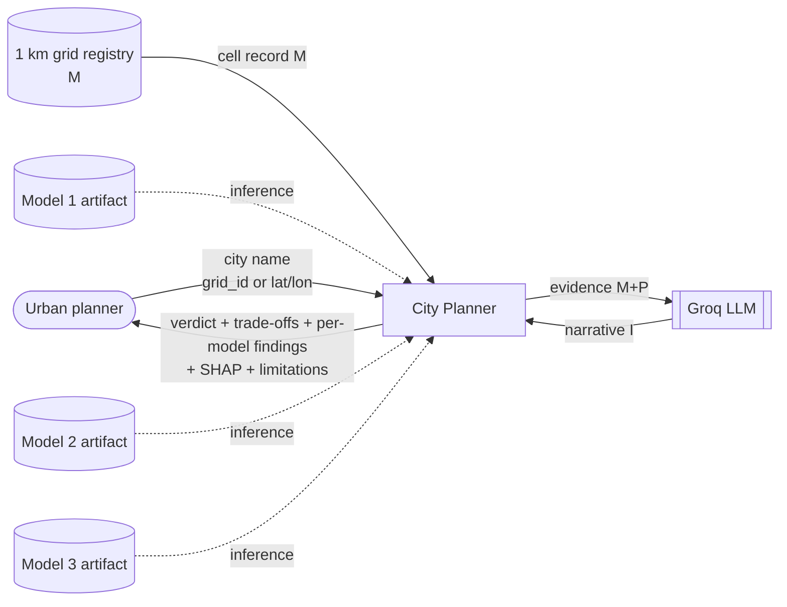
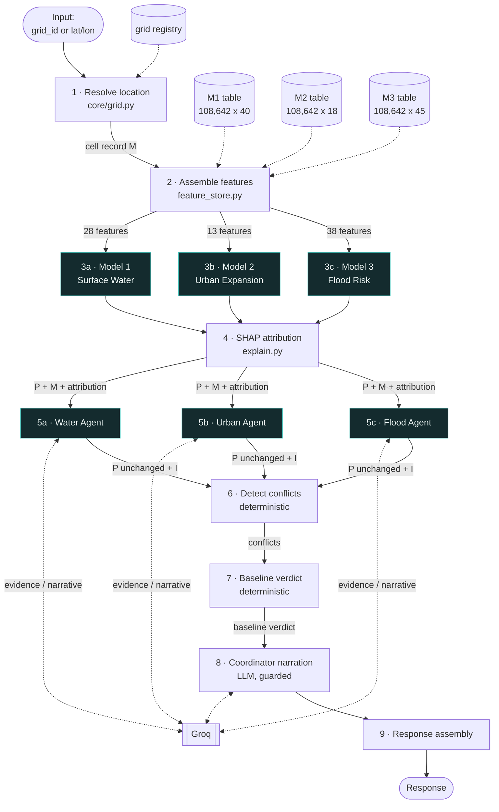
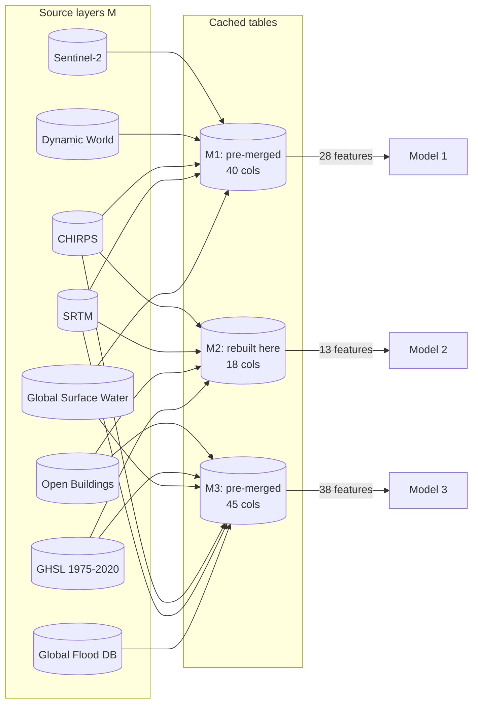
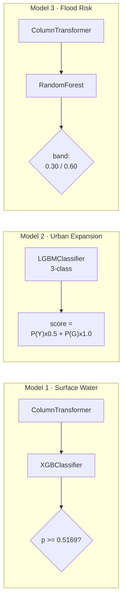
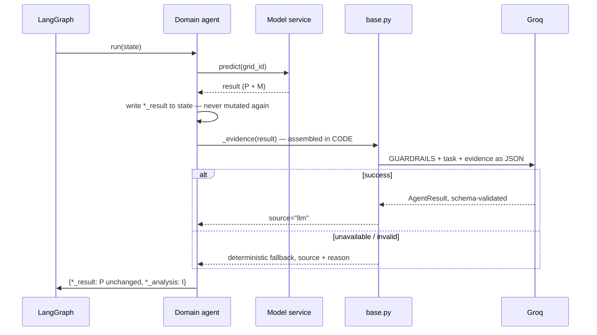
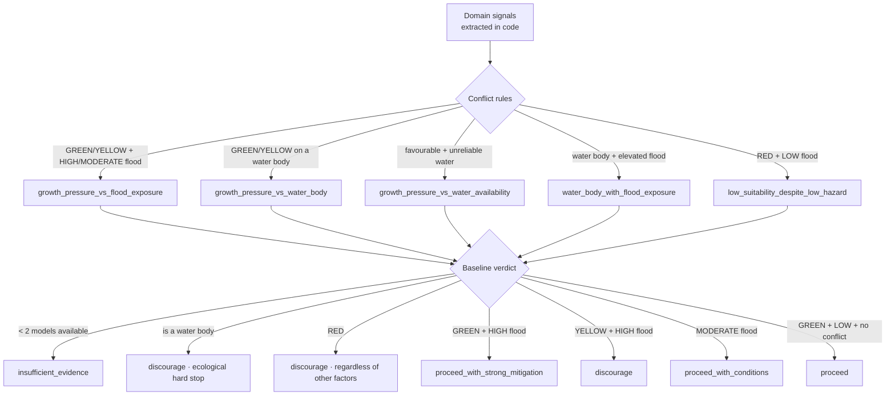
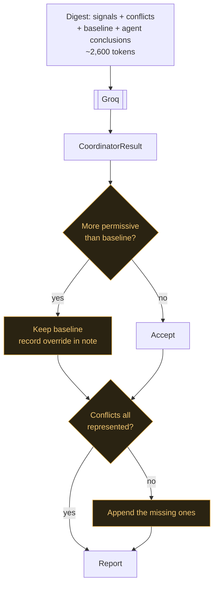
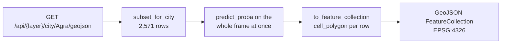
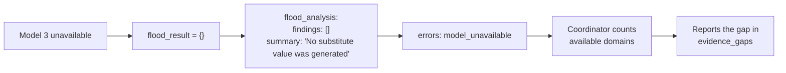

# Process 1 — City Planner: Data Flow

**Question answered:** should this square kilometre be developed, and on what terms?

All payloads below are real, captured from grid cell **`Agra_86833145`**
(Agra, Uttar Pradesh, 27.1762°N 78.0052°E).

---

## Level 0 — Context



---

## Level 1 — Stages



Stages 3a–3c and 5a–5c run **concurrently**.

---

## Stage 1 — Resolve location

| | |
|---|---|
| **Component** | `app/core/grid.py` |
| **In** | `{"grid_id": "Agra_86833145"}` or `{"lat": 27.1767, "lon": 78.0072}` |
| **Out** | Cell record (**M**) |
| **Never** | Snaps a point more than 25 km from any cell |

Coordinates are matched by **haversine great-circle distance**, so the match is correct
at any latitude, and the snap distance is returned so the caller knows the resolution
they actually got.

```json
{
  "grid_id": "Agra_86833145",
  "city": "Agra",
  "state": "Uttar Pradesh",
  "lat": 27.176176692751397,
  "lon": 78.00520769655562,
  "is_core": 0,
  "distance_km": 0.205
}
```

Failure: `404 grid_not_found`, carrying the distance to the nearest cell and the list of
covered cities.

---

## Stage 2 — Assemble features

| | |
|---|---|
| **Component** | `app/services/models/feature_store.py` |
| **In** | `grid_id` |
| **Out** | One `pandas` DataFrame row per model |
| **Never** | Imputes a missing value |

**Feature order comes from the fitted estimator itself** — `feature_names_in_` for the
sklearn pipelines, `booster_.feature_name()` for LightGBM — never from a hand-written
list that could drift from the artifact.



Models 1 and 3 ship pre-merged datasets. **Model 2 does not**, so its table is rebuilt
here by joining GHSL, Open Buildings, SRTM and CHIRPS on `grid_id`.

### Feature vectors

<details>
<summary><b>Model 1 — 28 features</b></summary>

```
state (categorical), lat, lon, is_core,
elevation_m, slope_deg, depression_index_m,
ndbi, ndvi, built, trees, temperature_2m_C,
rainfall_annual_mm_2024, rainfall_annual_mm_mean/max/std,
rainfall_m01..m12_climatology
```

Example: `state="Uttar Pradesh"`, `elevation_m=170.205`, `slope_deg=2.821`
</details>

<details>
<summary><b>Model 2 — 13 features</b></summary>

```
built_t0,                                        GHSL built fraction at 2000
building_count_total, building_height_mean,      Open Buildings
building_presence_mean,
elevation_m, slope_deg, depression_index_m,      SRTM
rainfall_annual_mm,                              CHIRPS 2020
lat, lon, is_core, city_code, state_code
```

Example: `built_t0=0.305`, `building_count_total=11.395`, `building_height_mean=2.892`

`city_code`/`state_code` are alphabetical category codes over the full 45-city grid.
The training run did not document this encoding; the reconstruction was verified at
**85.4% agreement** with the forward-validation target against a 33% chance level.
</details>

<details>
<summary><b>Model 3 — 38 features</b></summary>

```
is_core, lat, lon, state (categorical),
elevation_m, slope_deg, depression_index_m,      SRTM
water_occurrence_pct, water_fraction,            Global Surface Water
water_seasonality_months, water_recurrence_pct,
water_max_extent_pct, water_max_extent_fraction,
built_fraction_1975/1990/2000/2015/2020,         GHSL time series
built_surface_m2_2020, built_fraction_growth,
building_count_total, building_height_mean,      Open Buildings
building_presence_mean,
rainfall_annual_mm_mean/max/std,                 CHIRPS
rainfall_m01..m12_climatology
```
</details>

**Missing values stay NaN.** Both model families handle NaN natively; imputing here
would fabricate evidence the model then treats as observed. Affected features are
reported back in `incomplete_features`.

---

## Stage 3 — Model inference (parallel)



Thresholds are **not invented here** — they are read from each training run's saved
`thresholds.json`, tuned on its validation cities.

### Model 1 output (**P** + **M**, kept separate)

```json
{
  "model": "Surface Water Monitoring",
  "algorithm": "xgboost",
  "grid_id": "Agra_86833145",
  "water_body_probability": 0.1551,
  "is_water_body": false,
  "classification": "non_water_body",
  "decision_threshold": 0.5169,

  "observed": {
    "water_occurrence_pct": 0.0,
    "water_fraction": 0.0,
    "water_seasonality_months": 0.0,
    "water_recurrence_pct": 75.0
  },
  "water_body_status": {
    "status": "none",
    "inter_annual_reliability": "high",
    "water_body_threshold_pct": 25.0,
    "basis": "Global Surface Water (JRC GSW) observations — measured, not predicted"
  },
  "incomplete_features": [],
  "feature_attribution": [ ... ]
}
```

`observed` is **M**, `water_body_probability` is **P**. The `basis` string carries that
distinction into any consumer that renders it.

### Model 2 output (**P** + deterministic constraints **R**)

```json
{
  "suitability_score": 0.6324,
  "suitability_class": "YELLOW",
  "class_meaning": "Conditional — requires further consideration",
  "confidence": 0.6983,
  "class_probabilities": { "RED": 0.1449, "YELLOW": 0.6983, "GREEN": 0.1568 },
  "score_definition": "P(YELLOW)*0.5 + P(GREEN)*1.0, bounded to [0, 1]",
  "classification_rule": "argmax of class probabilities (as validated)",

  "observed": {
    "built_fraction_t0": 0.305, "built_fraction_t1": 0.339,
    "built_growth_t0_t1": 0.034, "t0_year": 2000, "t1_year": 2020
  },
  "constraints": []
}
```

The model is a **forward-validation** classifier: features describe the cell in 2000,
the label is which tercile of built-up growth it fell into by 2020. The score measures
**propensity for expansion**, not environmental desirability — which is exactly why the
Coordinator exists.

### Model 3 output (**P** + measured drivers **M**)

```json
{
  "flood_probability": 0.4261,
  "risk_level": "MODERATE",
  "risk_meaning": "Moderate flood susceptibility — resilience measures required",
  "decision_threshold": 0.5718,
  "risk_bands": { "high_at_or_above": 0.6, "moderate_at_or_above": 0.3 },
  "risk_drivers": [],
  "observed": {
    "historical_flood_label": 0,
    "flood_record_source": "Global_Flood_Database",
    "flood_record_period": "2000_2018",
    "elevation_m": 170.081, "slope_deg": 4.747
  }
}
```

`risk_drivers` are computed **in code** from the measured layers (low elevation, flat
terrain, local depression, surface-water presence, high rainfall, impervious surface,
rapid urbanisation), each carrying the measurement that triggered it. They exist so an
explanation can cite evidence rather than paraphrase the probability back.

---

## Stage 4 — SHAP attribution

| | |
|---|---|
| **Component** | `app/services/models/explain.py` |
| **In** | The same feature row |
| **Out** | Top-8 contributions, or `null` |
| **Never** | Approximates when SHAP is unavailable |

For the pipeline models the row is transformed first and the explainer runs on the final
estimator; **one-hot columns are folded back onto their source feature**, so a caller
sees `state`, not `state_Kerala`.

```json
[
  { "feature": "ndvi",        "importance": 0.264, "direction": "positive", "shap_value": 1.263 },
  { "feature": "ndbi",        "importance": 0.164, "direction": "negative", "shap_value": -0.783 },
  { "feature": "elevation_m", "importance": 0.112, "direction": "positive", "shap_value": 0.536 }
]
```

`importance` is the share of the row's total absolute attribution. If `shap` is not
installed the field is `null` and the UI says attributions are unavailable.

---

## Stage 5 — Domain agents (parallel)



### What the LLM is allowed to see

Evidence is assembled by code, serialised as JSON (not prose — JSON keeps numbers
verbatim, makes nulls explicit, and gives the model no sentence to paraphrase a figure
out of):

```json
{
  "grid_cell": { "grid_id": "Agra_86833145", "city": "Agra", "state": "Uttar Pradesh" },
  "model_prediction": {
    "model": "Surface Water Monitoring", "algorithm": "xgboost",
    "water_body_probability": 0.1551,
    "classification": "non_water_body",
    "decision_threshold": 0.5169
  },
  "measured_observations": { "water_occurrence_pct": 0.0, "water_recurrence_pct": 75.0 },
  "derived_water_body_status": { "status": "none", "inter_annual_reliability": "high" },
  "top_contributing_features": [ ...top 5... ],
  "incomplete_features": []
}
```

### What the LLM may return

```python
class AgentResult(BaseModel):
    model_config = ConfigDict(extra="forbid")
    domain: str
    summary: str
    findings: list[str]
    risks: list[str]
    recommendations: list[str]
    uncertainty: str
    interpretation_confidence: Literal["high", "medium", "low"]
```

**There is no numeric field.** An agent physically cannot return a competing probability
— the schema has nowhere to put one. `interpretation_confidence` is the agent's
confidence in its own reading, and the UI labels it as such so it is never mistaken for
a model probability.

Guardrails prepended to every call: predictions come from models; never invent a value;
never override a prediction; keep measured / predicted / rule-based / interpreted
distinct in ordinary prose; state uncertainty; return the exact schema.

---

## Stages 6 and 7 — Deterministic conflict detection and verdict

**This is the part that is not an LLM.** Detection and decision are rule-based so a
genuine conflict cannot be missed because the model overlooked it, and so the verdict is
reproducible and testable.



### Signals for this cell

```json
{
  "water": { "available": true, "is_water_body": false,
             "water_body_probability": 0.1551, "status": "none",
             "inter_annual_reliability": "high" },
  "urban": { "available": true, "suitability_class": "YELLOW",
             "suitability_score": 0.6324, "confidence": 0.6983, "constraints": [] },
  "flood": { "available": true, "flood_probability": 0.4261,
             "risk_level": "MODERATE", "drivers": [] },
  "building": { "available": false }
}
```

### Detected conflict

```json
[{
  "type": "growth_pressure_vs_flood_exposure",
  "severity": "moderate",
  "between": ["urban", "flood"],
  "description": "The area shows YELLOW expansion suitability while flood risk is MODERATE (probability 43%).",
  "implication": "Growth pressure and flood exposure coincide, which is how flood-exposed development happens. Expansion should not proceed unrestricted."
}]
```

### Baseline verdict

```json
{
  "verdict": "proceed_with_conditions",
  "reasons": ["Flood risk is MODERATE (probability 43%), requiring resilience measures."]
}
```

**The ecological guarantee follows from this structure.** A water-body cell is a hard
stop that overrides any suitability score, and the flood and water signals are in the
baseline rule and in the appended conflicts regardless of what the LLM writes. A
favourable urban score can never suppress an environmental finding.

---

## Stage 8 — Coordinator narration, guarded



The prompt carries a **digest**, not the raw payloads: `signals` already holds every
number the synthesis turns on, and each agent's reading is condensed to its conclusions.
This keeps the prompt near 2,600 tokens; sending the full model outputs pushed it past
7,400 and hit the free-tier rate limit.

```python
class CoordinatorResult(BaseModel):
    overall_recommendation: Literal["proceed", "proceed_with_conditions",
        "proceed_with_strong_mitigation", "discourage", "insufficient_evidence"]
    headline: str
    rationale: str
    trade_offs: list[TradeOff]      # between, tension, resolution
    conditions: list[str]
    priority_actions: list[str]
    evidence_gaps: list[str]
```

---

## Stage 9 — Response

```json
{
  "location": { "grid_id": "Agra_86833145", "city": "Agra", "resolved_from": "grid_id" },
  "recommendation": { "overall_recommendation": "...", "headline": "...", "trade_offs": [...] },
  "detected_conflicts": [...],
  "domain_signals": {...},
  "interpretation_source": "llm",
  "llm_model": "openai/gpt-oss-120b",
  "domains": {
    "water":  { "model_output": {...P...}, "analysis": {...I...} },
    "urban":  { "model_output": {...P...}, "analysis": {...I...} },
    "flood":  { "model_output": {...P...}, "analysis": {...I...} },
    "building": { "model_output": null, "analysis": null }
  },
  "trace": [...],
  "errors": [],
  "principle": "LLM agents interpret predictive model outputs; they do not replace them."
}
```

`model_output` and `analysis` sit side by side at every domain, so a consumer can always
verify the narrative against the number it describes.

---

## The map layer flow

A separate, lighter path — no agents, no LLM, vectorised across the whole city.



```json
{
  "type": "Feature",
  "id": "Agra_86793117",
  "geometry": { "type": "Polygon", "coordinates": [[[77.9642, 26.9477], "..."]] },
  "properties": {
    "grid_id": "Agra_86793117", "city": "Agra",
    "water_body_probability": 0.0809, "is_water_body": false,
    "classification": "non_water_body", "observed_occurrence_pct": 0.0,
    "lat": 26.952192, "lon": 77.969275
  }
}
```

Cell geometry is the lat/lon envelope of a 1 km cell about the exported centroid, with
the longitude half-extent scaled by `cos(latitude)` so cells stay ~1 km wide at every
latitude. Each city is a **25 km radius disc** around its centre, which is why the map
shows a circle.

---

## Failure modes

| Stage | Failure | Behaviour |
|---|---|---|
| 1 | Unknown `grid_id` | `404 grid_not_found` |
| 1 | Point > 25 km from any cell | `404` with distance and covered cities |
| 2 | Feature table missing | `503 dataset_unavailable` naming the file |
| 3 | Artifact missing | `503 model_unavailable` + config key |
| 3 | Threshold absent | `inference_failed` — refuses to classify |
| 4 | SHAP unavailable | `feature_attribution: null` |
| 5 | One model fails | That domain becomes a stated gap; others continue |
| 5 | Groq unavailable | Deterministic summary + reason |
| 6–7 | < 2 domains available | `insufficient_evidence` |
| 8 | LLM too permissive | Baseline kept, override recorded |
| 8 | LLM omits a conflict | Missing conflicts appended |



A domain that fails contributes **no findings** — never a neutral or default value that
would quietly tilt the synthesis.
