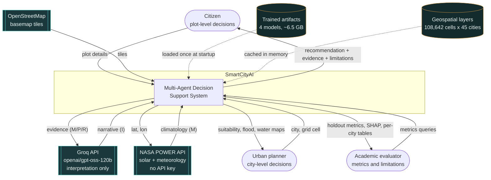
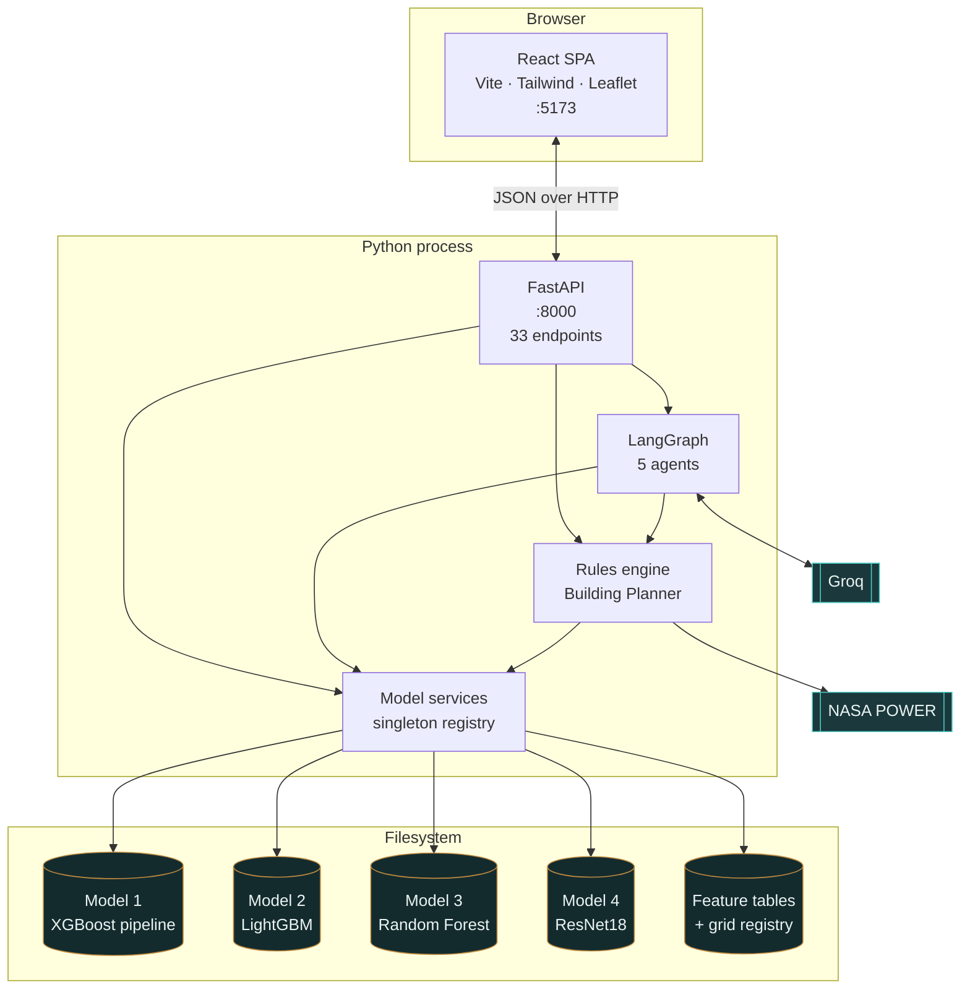
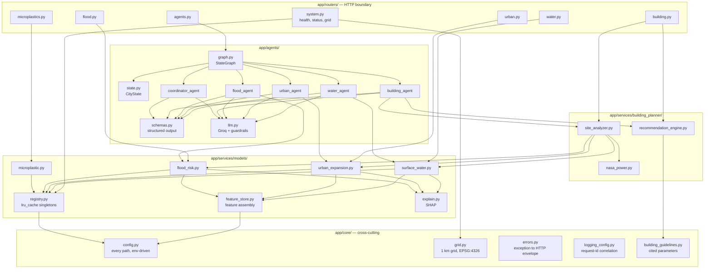
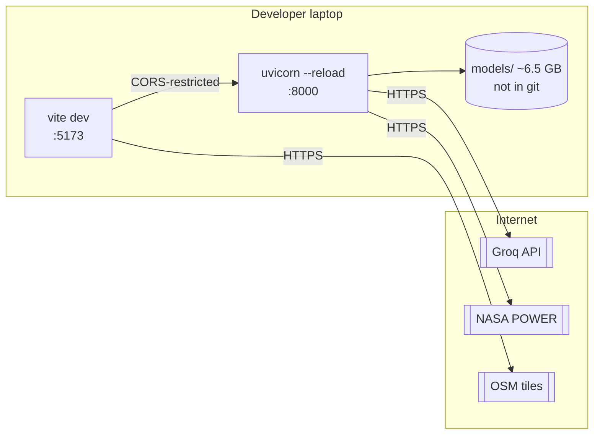
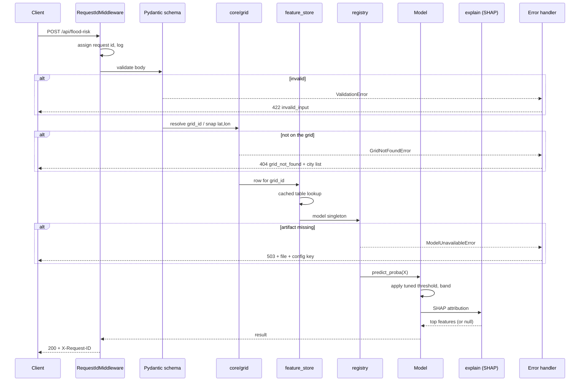
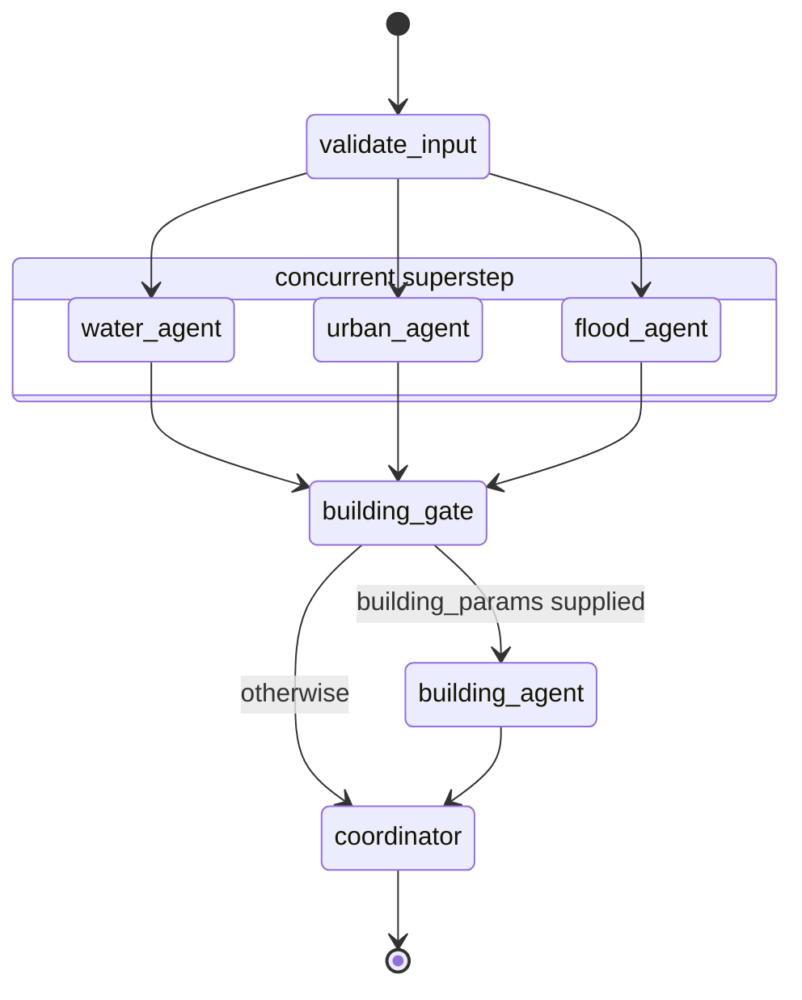
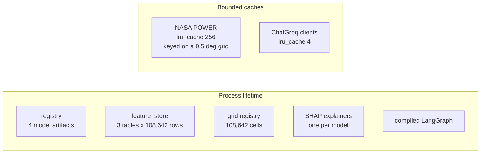
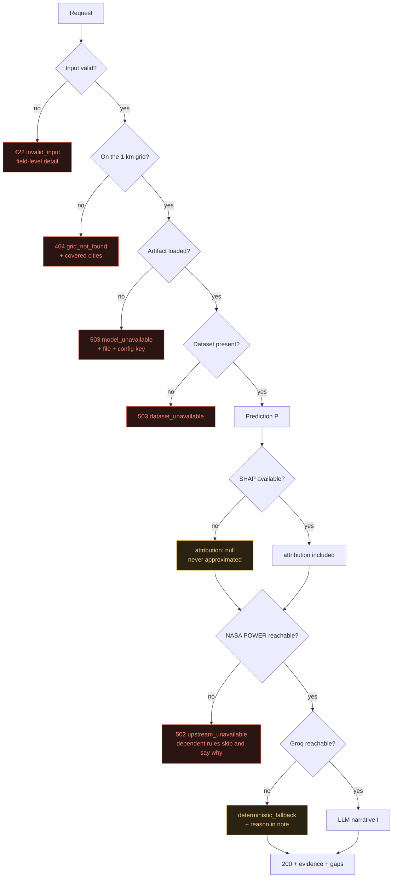

# System Architecture

Four levels of increasing detail, then the runtime concerns: request lifecycle,
concurrency, caching and failure handling.

---

## Level 1 — System context

Who and what the system talks to.



**External dependencies and what happens without them**

| Dependency | Required? | Without it |
|---|---|---|
| Groq | No | Agents emit deterministic summaries, labelled `deterministic_fallback` |
| NASA POWER | For the Building Planner | `502 upstream_unavailable`; affected rules skip and say why. **No fallback values.** |
| OpenStreetMap | No | Map renders grid cells on a blank ground |
| Model artifacts | Yes, per model | `503 model_unavailable` naming the file and config key |

---

## Level 2 — Containers



Everything runs in **one Python process**. The models are tree ensembles plus one
ResNet18 on CPU, so no model server, GPU or message broker is needed — it runs on a
laptop.

---

## Level 3 — Components



### Component responsibilities

| Component | Owns | Must never |
|---|---|---|
| `core/config.py` | Every filesystem path and key | Be bypassed by a hard-coded path |
| `core/grid.py` | The 1 km grid; id lookup, nearest-cell, GeoJSON | Transform coordinates between CRSs |
| `models/registry.py` | Loading artifacts once | Reload per request |
| `models/feature_store.py` | Feature-table assembly and row lookup | Impute a missing value |
| `models/*.py` | Inference, thresholds, banding | Explain itself in prose |
| `building_planner/nasa_power.py` | External meteorology | Substitute fallback values |
| `building_planner/recommendation_engine.py` | Which rules fire, and every number | Consult an LLM |
| `agents/llm.py` | Groq calls, guardrails, degradation | Let an invalid response through |
| `agents/coordinator_agent.py` | Conflict detection, baseline verdict | Let the LLM loosen a verdict |

---

## Level 4 — Deployment



**Resource profile, measured**

| Aspect | Value |
|---|---|
| Startup (model warm-up) | ~5 s |
| Resident memory | ~1.5 GB, dominated by the three feature tables |
| Single-cell prediction | < 100 ms per model, including SHAP |
| Whole-city layer (2,571 cells) | ~1 s, vectorised |
| Full 5-agent pipeline | 20–25 s, dominated by Groq round trips |
| Artifacts on disk | ~6.5 GB |

---

## Request lifecycle



Every log line carries the request id via a `ContextVar`, so one request is traceable
end to end: request → inference → agent → coordinator → response.

---

## The LangGraph execution model



**Why the barrier works.** Three edges into `building_gate` mean LangGraph will not
execute it until all three inbound nodes complete. No merge reducer is needed because
each agent writes only its own `*_result` and `*_analysis` keys. The two keys several
nodes append to — `errors` and `trace` — carry `operator.add` reducers.

**The concurrency is measured, not assumed.**
`tests/test_agents.py::TestGraph::test_domain_agents_run_concurrently` instruments the
three agents and asserts their execution windows overlap, that more than one thread is
used, and that wall time is below the serial sum: **5.92 s against 14.18 s of summed
work, across three threads.**

### State

```python
class CityState(TypedDict, total=False):
    location: dict
    building_params: dict | None
    options: dict

    water_result: dict        # P — model output, never mutated after writing
    urban_result: dict        # P
    flood_result: dict        # P
    building_result: dict     # R — rules output

    water_analysis: dict      # I — agent interpretation
    urban_analysis: dict      # I
    flood_analysis: dict      # I
    building_analysis: dict   # I

    coordinator_result: dict  # I, over a deterministic skeleton

    errors: Annotated[list[dict], operator.add]
    trace: Annotated[list[str], operator.add]
```

The `*_result` / `*_analysis` split is the architectural boundary. A caller can always
read the raw model number beside the interpretation of it and confirm they agree.

---

## Caching



NASA POWER responses are cached on a 0.5° grid because that is the API's own
reanalysis resolution — neighbouring requests would return the same cell anyway.

---

## Failure-mode map



**The invariant across every branch:** nothing is ever silently replaced with a
plausible-looking value. A degraded response says which part degraded and why.

---

## Where the governing rule is enforced

| Enforcement | Location |
|---|---|
| Agent schemas have no numeric prediction field | `agents/schemas.py` |
| Model output and interpretation are separate state keys | `agents/state.py` |
| Evidence is assembled from model output in code, not by the LLM | `agents/base.py` |
| Conflict detection and baseline verdict are deterministic | `agents/coordinator_agent.py` |
| The LLM may tighten a verdict, never loosen it | `agents/coordinator_agent.py` |
| Guardrails prepended to every prompt | `agents/llm.py` |
| Responses are schema-validated before entering the graph | `agents/llm.py` |

The verdict guard, concretely — verdicts are ordered by permissiveness, and if the LLM
returns one more permissive than the deterministic baseline, the baseline is kept and
the attempted override is recorded in `note`:

```python
_PERMISSIVENESS = {
    "proceed": 0,
    "proceed_with_conditions": 1,
    "proceed_with_strong_mitigation": 2,
    "discourage": 3,
    "insufficient_evidence": 4,
}
```

Covered by `test_llm_cannot_loosen_the_deterministic_verdict`.
