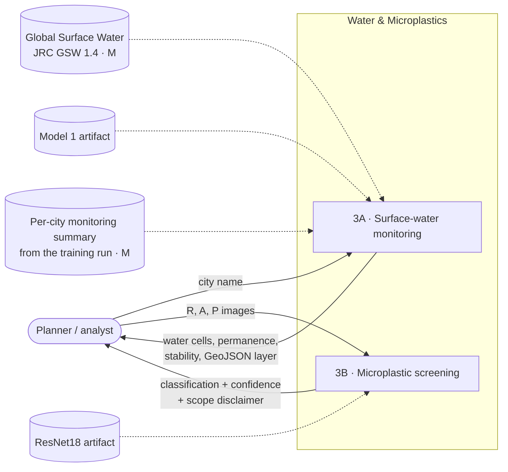
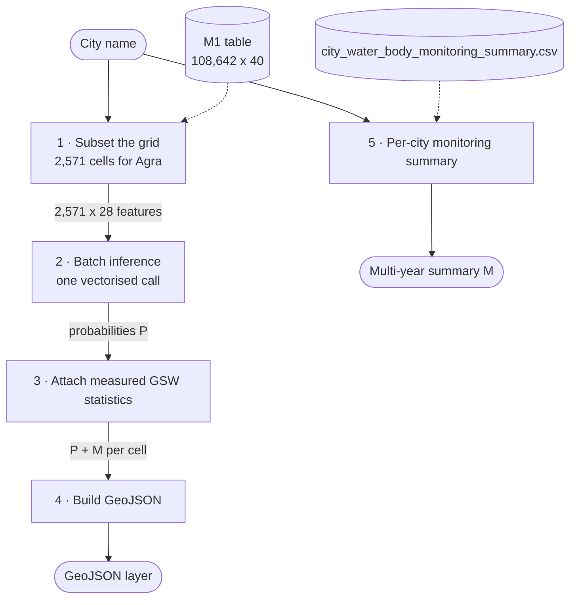
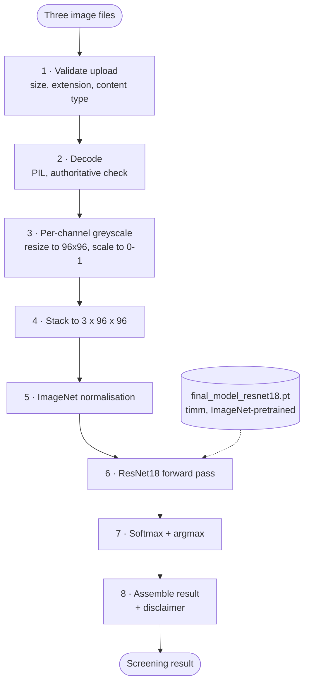
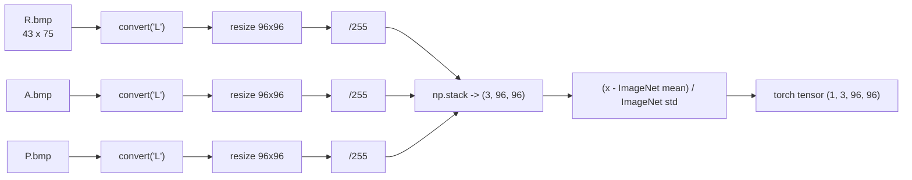
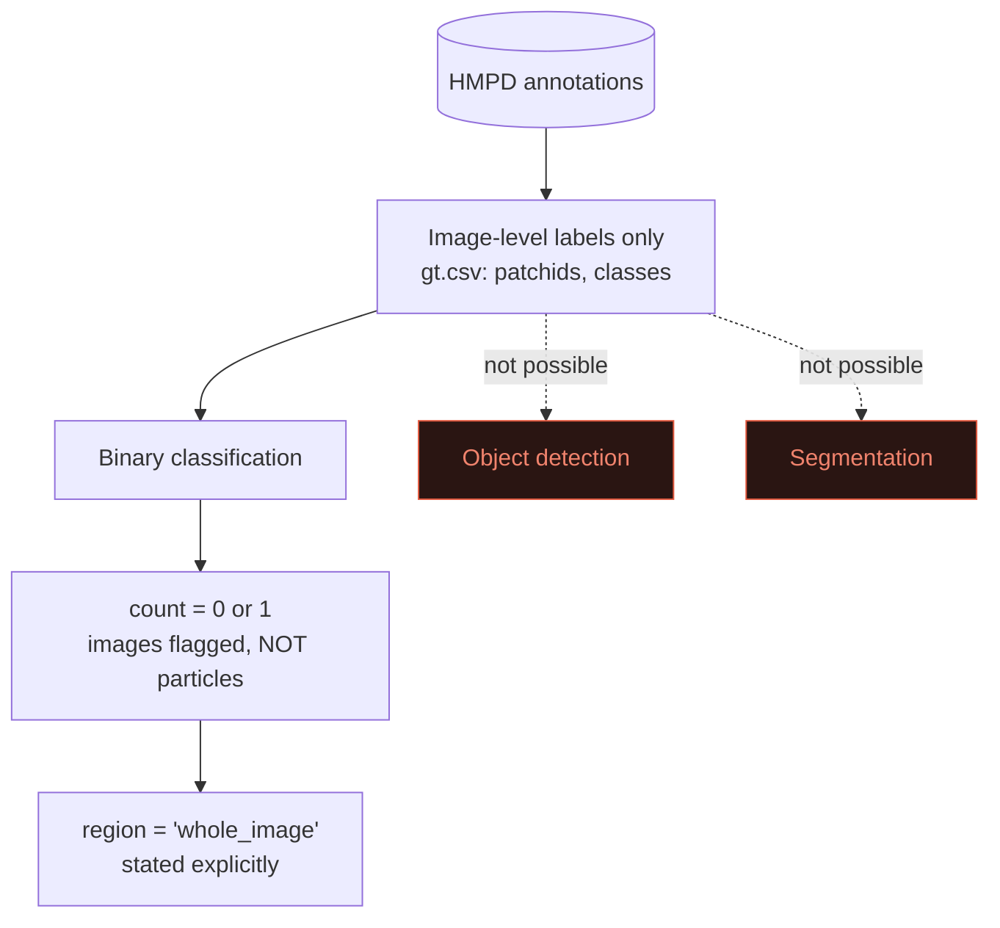
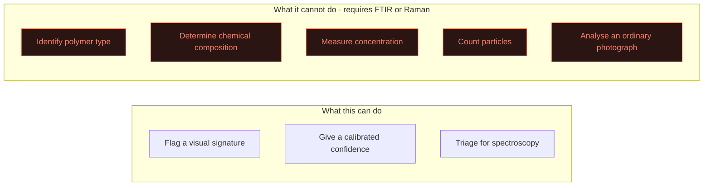
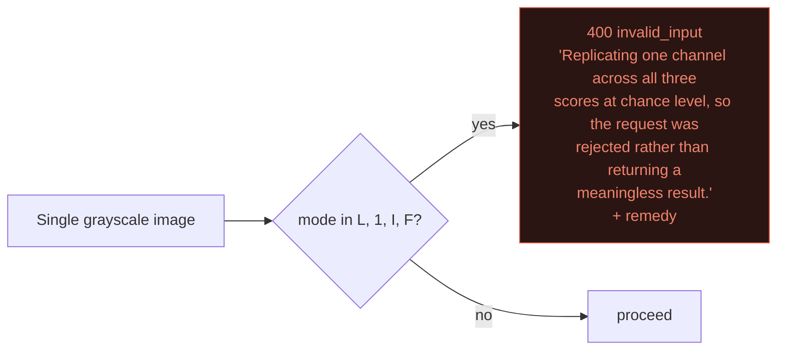

# Process 3 — Water & Microplastics: Data Flow

Two independent pipelines behind one page:

| Pipeline | Input | Output | Nature |
|---|---|---|---|
| **3A** Surface-water monitoring | City name | City-wide water statistics and map layer | Geospatial, batch |
| **3B** Microplastic screening | Three microscopy images | Screening classification | Computer vision, per-particle |

They share a page because both concern water quality, but they share no data path.

---

## Level 0 — Context



---

# 3A — Surface-water monitoring

## Stages



**No agents and no LLM in this path.** It is a straight geospatial query.

## Stage 2 — Batch inference

The whole city goes through `predict_proba` in **one call**, not 2,571 calls:

```python
probabilities = model.predict_proba(table[features])[:, 1]   # (2571,)
is_water = probabilities >= 0.5169                            # tuned threshold
```

~1 second for a full city.

## Stage 3 — Per-cell record

Prediction (**P**) and observation (**M**) travel side by side and stay labelled:

```json
{
  "grid_id": "Agra_86793117",
  "city": "Agra",
  "lat": 26.952192,
  "lon": 77.969275,
  "water_body_probability": 0.0809,
  "is_water_body": false,
  "classification": "non_water_body",
  "observed_occurrence_pct": 0.0
}
```

## Stage 4 — GeoJSON

```json
{
  "type": "Feature",
  "id": "Agra_86793117",
  "geometry": {
    "type": "Polygon",
    "coordinates": [[
      [77.9642304887245, 26.947695398181377],
      [77.9743195112755, 26.947695398181377],
      [77.9743195112755, 26.956688601818623],
      [77.9642304887245, 26.956688601818623],
      [77.9642304887245, 26.947695398181377]
    ]]
  },
  "properties": {
    "grid_id": "Agra_86793117", "city": "Agra",
    "water_body_probability": 0.0809, "is_water_body": false,
    "classification": "non_water_body", "observed_occurrence_pct": 0.0,
    "lat": 26.952192, "lon": 77.969275
  }
}
```

The collection carries its CRS explicitly:

```json
{ "type": "FeatureCollection",
  "crs": { "type": "name", "properties": { "name": "EPSG:4326" } },
  "features": [ ... ] }
```

## Stage 5 — Multi-year monitoring

This answers "are water bodies shrinking?" — and it is **measured, not predicted**,
read from the training run's own summary:

```json
{
  "city": "Chennai",
  "summary": [{
    "city": "Chennai",
    "n_water_cells": 1212,
    "pct_permanent": 0.828,
    "pct_stable": 0.993,
    "mean_occurrence_pct": 88.893
  }],
  "basis": "Global Surface Water (JRC GSW) observations aggregated per city during model training. Measured, not predicted."
}
```

### A deliberate omission

An earlier implementation derived an "extent trend" by differencing
`water_max_extent_pct` against `water_occurrence_pct`. **That was wrong** — those two
columns are on different scales in this dataset (max extent tops out at 1.0, occurrence
at 100), so the difference measured nothing. It was removed rather than rescaled, since
any rescaling would have been a guess. Multi-year stability is reported per city from
the measured summary instead.

The per-cell water status now reports only well-defined quantities:

```json
{
  "status": "none",
  "seasonality_months": 0.0,
  "occurrence_pct": 0.0,
  "inter_annual_reliability": "high",
  "recurrence_pct": 75.0,
  "water_body_threshold_pct": 25.0,
  "basis": "Global Surface Water (JRC GSW) observations — measured, not predicted"
}
```

---

# 3B — Microplastic screening

## The input construction, and why it is enforced

HMPD images each particle **three times** under polarisation microscopy:

| Channel | Measurement |
|---|---|
| **R** | reflectance |
| **A** | angle of polarisation |
| **P** | degree of polarisation |

These stack into the network's three input channels. Feeding only reflectance,
replicated across RGB, was measured against HMPD ground truth on 231 labelled particles:

| Input construction | Accuracy | Precision | Recall |
|---|---|---|---|
| **R/A/P stacked** (correct) | **0.978** | 0.984 | 0.977 |
| R only, replicated | 0.450 | 1.000 | **0.008** |

Reflectance alone detects essentially nothing (recall 0.008) while appearing confident.
The API therefore **requires all three channels and rejects a single-channel upload**
rather than returning a meaningless answer.

## Stages



### Stage 1 — Validation

| Check | Rule | Failure |
|---|---|---|
| Size | ≤ `MAX_UPLOAD_BYTES` (10 MB), enforced **while streaming** | `400` |
| Extension | `.png .jpg .jpeg .bmp .tif .tiff .webp` | `400` |
| Content type | Only obviously-wrong types rejected | `400` |
| Filename | Reduced to basename; used **only** for the extension | — |

Client-declared content type is unreliable — `curl` sends `.bmp` as
`application/octet-stream` — so it only rejects the clearly wrong (`text/`, `video/`,
`audio/`, `application/json`, `application/pdf`). The authoritative checks are the
extension and an actual successful decode.

### Stages 3–5 — Preprocessing



Channel order is **R, A, P** — the training order. For the composite endpoint that order
is assumed and the assumption is reported in a warning.

If the three images differ in pixel dimensions, each is still resized, but a warning
notes they may not be co-registered views of the same particle.

### Stage 8 — Result

```json
{
  "model": "Microplastic Screening",
  "architecture": "resnet18 (timm, ImageNet pretrained)",
  "task": "binary image classification (screening)",

  "detections": [],
  "count": 0,
  "confidence": 0.9923,
  "classification": "no_microplastic_detected",
  "microplastic_detected": false,
  "class_probabilities": {
    "no_microplastic_detected": 0.9923,
    "microplastic_candidate": 0.0077
  },

  "input": {
    "mode": "polarimetric_triplet",
    "channels": { "R": "reflectance", "A": "angle of polarisation",
                  "P": "degree of polarisation" },
    "model_input_size": 96,
    "received_sizes": { "R": [43, 75], "A": [43, 75], "P": [43, 75] }
  },

  "warnings": [],
  "disclaimer": "Image-based screening only; does not determine chemical composition, polymer type, or absolute concentration. Confirmation requires FTIR or Raman spectroscopy on a prepared sample."
}
```

### What `count` means, and does not



HMPD ships image-level labels, so detection and segmentation heads were **not built** —
that would have required inventing annotations the dataset does not contain. `count` is
0 or 1: the number of *images* flagged, never a particle count. `region` is always
`whole_image`, said explicitly so the field is not mistaken for a bounding box.

## Scope boundary



| Claim | Why impossible here |
|---|---|
| Polymer identification | Needs vibrational spectroscopy; polymers are not visually separable |
| Chemical composition | Not recoverable from an image at any resolution |
| Particles per litre | Depends on sample volume and preparation, neither visible in an image |
| Particle count | HMPD labels are per-image |
| Ordinary photographs | No polarimetric signal; single-channel uploads are rejected |

The disclaimer is in **every response payload**, not only the documentation.

## Validation

5-fold stratified cross-validation on the balanced HMPD split (3,293 / 3,293):

| Metric | Mean | Std |
|---|---|---|
| Accuracy | 0.9283 | 0.0038 |
| F1 | 0.9294 | — |
| ROC-AUC | 0.9779 | — |

Recall consistently exceeds precision (~0.94 vs ~0.91) — appropriate for screening,
where a missed particle costs more than one sent for confirmation. No detection metrics
(mAP, IoU) are reported, because no detection model was built.

---

## Failure modes

| Pipeline | Failure | Behaviour |
|---|---|---|
| 3A | City not in the grid | `404` with covered cities |
| 3A | Model 1 unavailable | `503` + config key |
| 3A | No monitoring summary for that city | `available: false` with a note, not an empty chart |
| 3B | Single-channel upload | `400` explaining it scores at chance, with the remedy |
| 3B | A channel missing | `422` from FastAPI |
| 3B | Undecodable image | `400 invalid_input` |
| 3B | Over the size limit | `400`, caught **while streaming** |
| 3B | Mismatched channel sizes | Proceeds, warns about co-registration |
| 3B | Model 4 unavailable | `503` + config key |



Rejecting is the safer failure: a confident 99% answer from an input the model cannot
actually read would be worse than no answer.
